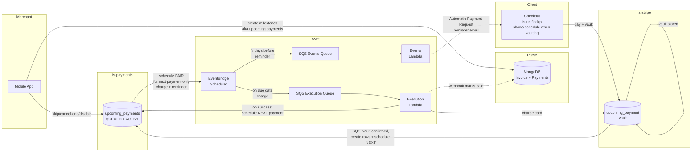
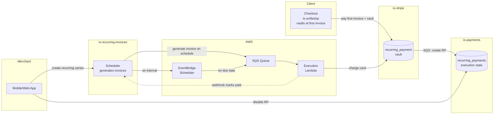

# Confluence Page Diagrams (Mermaid Source)

> Render these to PNG for embedding in Confluence.
> These correspond to the diagram placeholders in `2026-05-04-confluence-page.md`.

---

## Diagram 1: Today (manual)

```mermaid
graph LR
    subgraph Merchant
        M[Mobile App]
    end
    subgraph Parse
        P[(MongoDB<br/>Invoice + Payments)]
    end
    subgraph Client
        C[Checkout<br/>is-unifiedxp]
    end

    M -->|create invoice +<br/>milestones/upcoming payments| P
    M -->|mark paid manually| P
    C -->|pay via link| P

    style P fill:#f9f9f9
```

---

## Diagram 2: With Automatic Payments (Phase 1 — successive scheduling)

---

## Diagram 3: Recurring Payments (current architecture, for reference)

