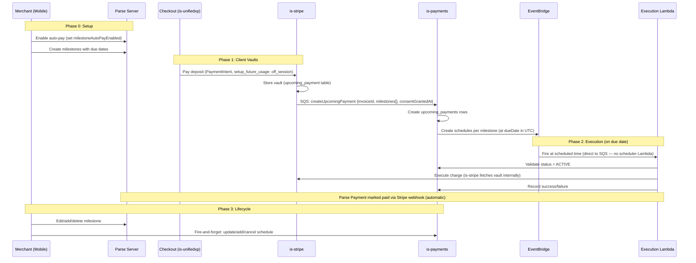
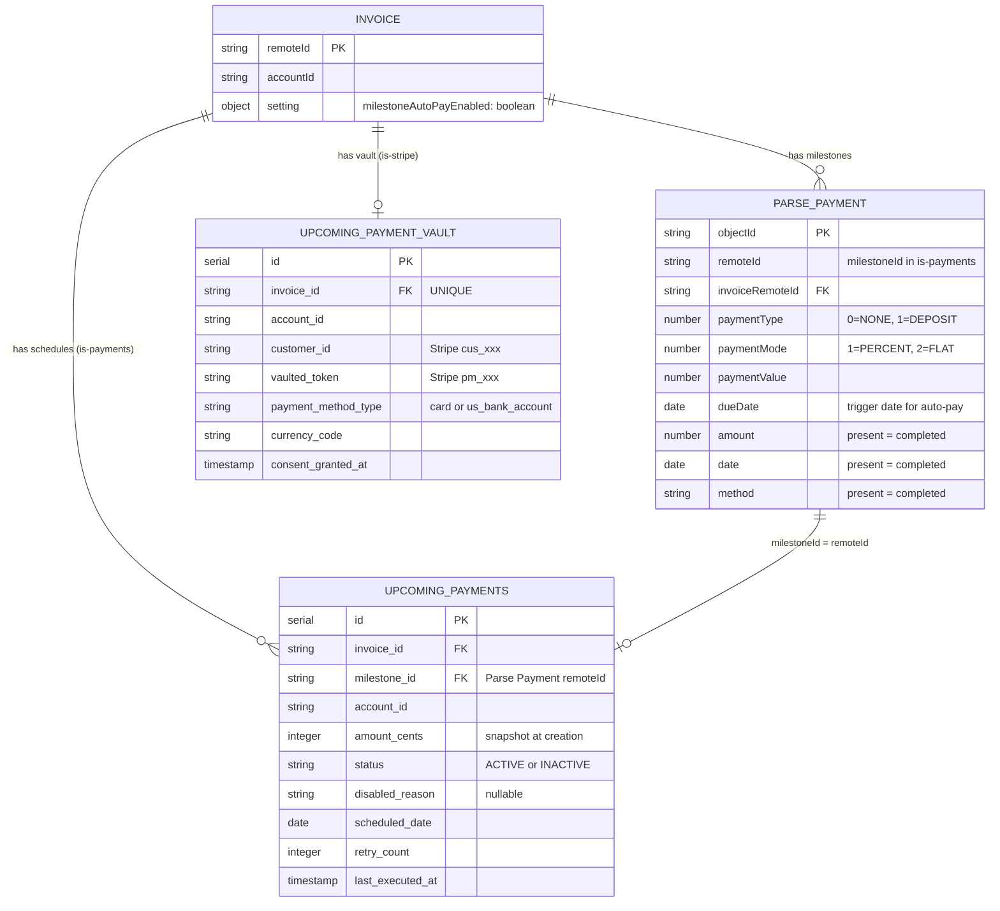
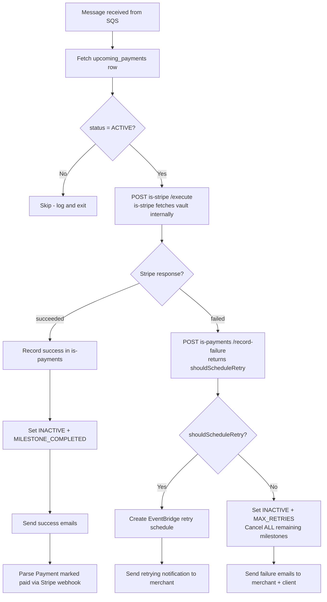
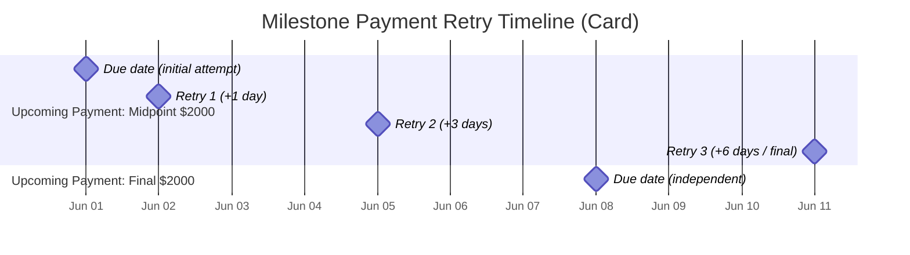
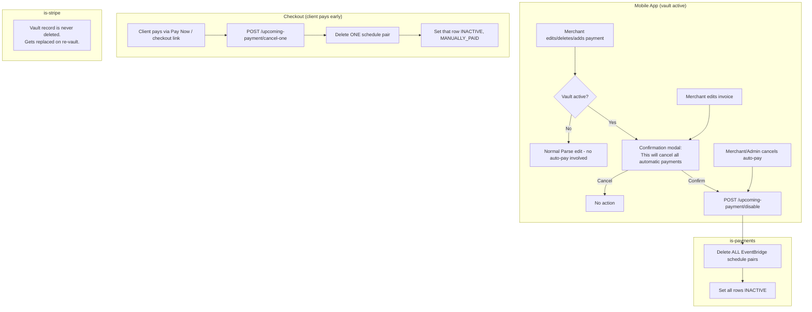
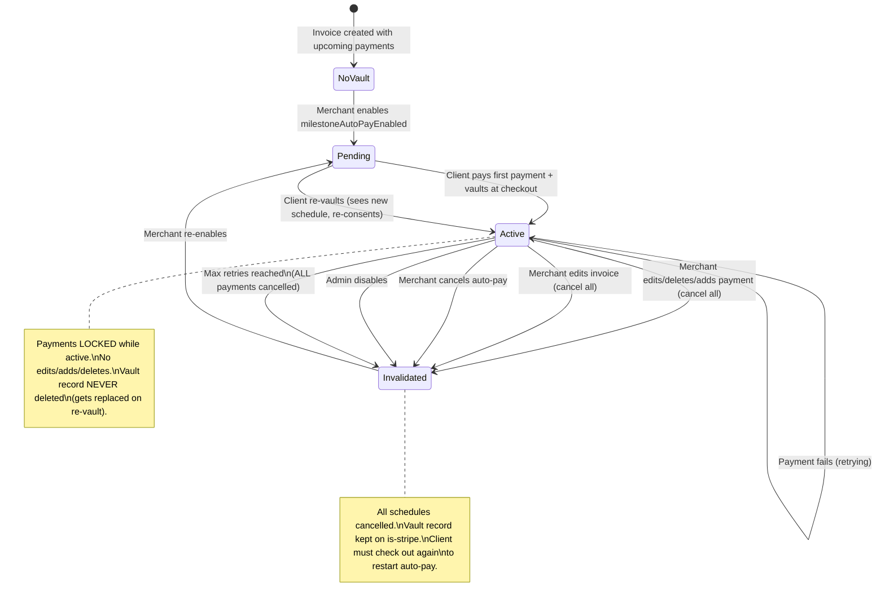
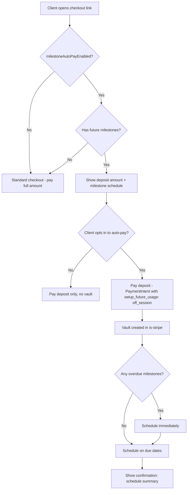
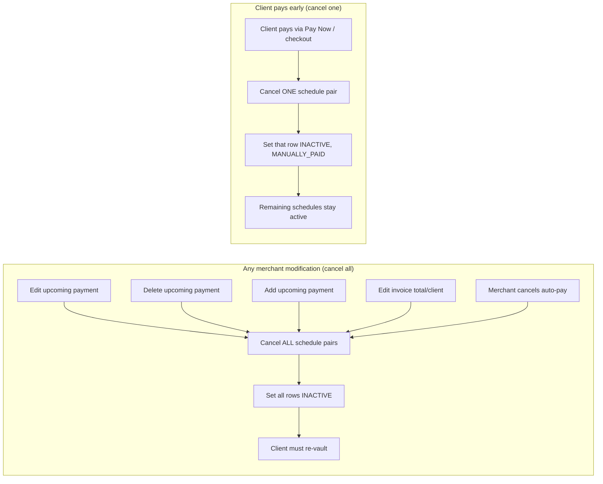

# Deposits & Milestones — Automatic Payments: Diagrams

## End-to-End Flow Overview



---

## Data Model Relationships



---

## Execution Lambda Decision Flow



---

## Retry Schedule Timeline



Note: Retries are independent per milestone. Two milestones can execute on the same day (they are separate obligations).

---

## Merchant Lifecycle Actions (Mobile) — Locked After Vault



---

## Vault Lifecycle State Machine



---

## Checkout UI Flow (Client Side)



---

## Infrastructure Architecture

```mermaid
graph TB
    subgraph "Clients"
        Mobile[Mobile App]
        Web[Web App]
        CX[Checkout is-unifiedxp]
    end

    subgraph "Parse"
        Parse[Parse Server<br/>Payment collection]
    end

    subgraph "is-stripe"
        StripeAPI[REST API]
        StripeDB[(upcoming_payment<br/>vault per invoice)]
        StripeSvc[Stripe SDK]
    end

    subgraph "is-payments"
        PayAPI[REST API]
        PayDB[(upcoming_payments<br/>per-milestone state)]
        EventsQ[payment-events-queue.fifo]
        EventsL[events-lambda<br/>topic dispatcher]
    end

    subgraph "AWS"
        EB[EventBridge Scheduler<br/>schedule per upcoming payment]
        ExecQ[upcoming-payment-execution-queue]
        ExecL[upcoming-payment-execution-lambda]
        DLQ[upcoming-payment-execution-dlq]
    end

    Mobile -->|CRUD payments| Parse
    Mobile -->|fire-and-forget| PayAPI
    Web -->|CRUD payments| Parse
    Web -->|fire-and-forget| PayAPI
    CX -->|vault + pay| StripeAPI

    StripeAPI --> StripeDB
    StripeAPI -->|SQS| EventsQ
    EventsQ --> EventsL
    EventsL --> PayDB
    EventsL --> EB

    PayAPI --> PayDB

    EB -->|at scheduled time| ExecQ
    ExecQ --> ExecL
    ExecL -->|validate| PayAPI
    ExecL -->|fetch vault + charge| StripeAPI
    ExecL -->|record result| PayAPI
    ExecL -->|mark paid| Parse
    ExecL -.->|retry| EB

    ExecQ -.->|failed 3x| DLQ
```

---

## Schedule Naming Convention

```
Charge:   upcoming-{invoiceId}-{paymentId}
Reminder: upcoming-reminder-{invoiceId}-{paymentId}
Retry:    upcoming-retry-{invoiceId}-{paymentId}-{retryCount}
RP:       payment-retry-{seriesId}-{retryCount}
```

All in shared `is-payments-retry-schedule-group`. No collisions due to distinct prefixes.

---

## Modification Impact Matrix (Locked After Vault — Decision 14)


