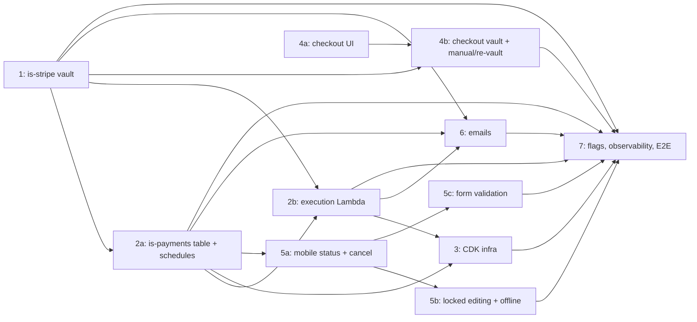

# Deposits & Milestones — Automatic Payments: Jira Tickets (Phase 1)

---

## Ticket 1: [is-stripe] Create `upcoming_payment` vault table and CRUD endpoints

**Estimate:** 8 SP

**Description:**
Create the foundational data layer and API endpoints in is-stripe for upcoming payment automatic payments vaulting. This stores one vault record per invoice when a client opts into auto-pay at checkout.

**Acceptance Criteria:**
- [ ] New Drizzle table `upcoming_payment` with columns: id, invoiceId (UNIQUE), accountId, customerId, vaultedToken, paymentMethodType, currencyCode, consentGrantedAt, createdAt, updatedAt
- [ ] Drizzle migration runs cleanly
- [ ] `POST /backend/upcoming-payment/vault` — creates/upserts vault record after PaymentIntent confirmation with `setup_future_usage: 'off_session'` (accepts invoiceId, accountId, customerId, vaultedToken, paymentMethodType, milestones[], timezone)
- [ ] `GET /backend/upcoming-payment?invoiceId={id}` — returns vault record for an invoice (or 404)
- [ ] Upsert by `invoiceId` — re-vault replaces existing record (vault is never deleted)
- [ ] `POST /backend/upcoming-payment/execute` — creates off-session PaymentIntent using vaultedToken (accepts invoiceId, milestoneId, amountCents, currencyCode; fetches vault internally; returns paymentIntentId, status)
- [ ] Idempotency key: `upcoming-{invoiceId}-{milestoneId}-{YYYY-MM-DD}`
- [ ] After vault creation, publish SQS to is-payments: `{ topic: 'createUpcomingPayment', invoiceId, accountId, milestones[], consentGrantedAt, timezone }`
- [ ] Reuse/adapt off-session charge utilities from RP (`stripe-payment-intent.ts` → `createStripeSDKPaymentIntent`)
- [ ] Unit tests for all endpoints (happy path + error cases)
- [ ] Authenticated with internal service secret (same as RP endpoints)

**Dependencies:** None (this is the foundation)
**Blocks:** Ticket 2a (is-payments), Ticket 3 (AWS infra), Ticket 4b (checkout)

---

## Ticket 2a: [is-payments] Create `upcoming_payments` table, SQS consumer, and schedule management endpoints

**Estimate:** 8 SP

**Description:**
Create the upcoming payment execution state table, SQS consumer for vault events from is-stripe, and the schedule management API. Handles schedule creation on vault (successive — only NEXT payment scheduled), skip, cancel-one (pay early), and cancel-all (disable).

**Acceptance Criteria:**
- [ ] New Drizzle table `upcoming_payments` (id, invoiceId, milestoneId, accountId, provider, amountCents, currencyCode, status [QUEUED/ACTIVE/INACTIVE], disabledReason [nullable], scheduledDate, retryCount, failureCode, failureDescription, isAsyncPaymentMethod, lastExecutedAt, createdAt, updatedAt; UNIQUE(invoiceId, milestoneId))
- [ ] Drizzle migration runs cleanly
- [ ] SQS consumer for `createUpcomingPayment` topic from is-stripe:
    - Creates `upcoming_payments` rows for ALL milestones in payload
    - FIRST unpaid milestone (soonest scheduledDate) → status: ACTIVE
    - All others → status: QUEUED (no EventBridge schedule)
    - Only creates EventBridge schedule PAIR for the ACTIVE milestone:
      - Charge schedule: `upcoming-{invoiceId}-{milestoneId}` → fires on `scheduledDate` at `time-of-day(consentGrantedAt)` in UTC
      - Reminder schedule: `upcoming-reminder-{invoiceId}-{milestoneId}` → fires N days before due date
    - Overdue detection: milestones with past due dates scheduled immediately (Decision 8 — pending final decision on Option A vs B)
- [ ] `POST /backend/upcoming-payment/disable` — cancel ACTIVE payment's schedule pair, set ALL rows (ACTIVE + QUEUED) to INACTIVE (accepts invoiceId, disabledReason). For: merchant cancel, admin cancel, invoice modify, max retries.
- [ ] `POST /backend/upcoming-payment/skip` — cancel ACTIVE payment's schedule pair, set it INACTIVE with disabledReason=SKIPPED, find next QUEUED milestone and promote to ACTIVE with new schedule pair (accepts invoiceId, milestoneId). For: merchant skips next payment.
- [ ] `POST /backend/upcoming-payment/cancel-one` — cancel that payment (if ACTIVE: delete schedule pair + advance chain; if QUEUED: just set INACTIVE), disabledReason=MANUALLY_PAID (accepts invoiceId, milestoneId). Used when client pays early via "Pay Now" or checkout link. (Decision 16 — pending confirmation)
- [ ] `advanceChain(invoiceId)` — shared utility used by skip, cancel-one, and handle-success: finds next QUEUED row (by scheduledDate ASC), creates schedule pair, sets to ACTIVE. Returns null if no more QUEUED.
- [ ] `GET /backend/upcoming-payment/invoice/:invoiceId` — list all upcoming payment records for an invoice
- [ ] EventBridge schedule create/delete utility (parallel functions to RP's scheduler utils, same schedule group `is-payments-retry-schedule-group`)
- [ ] Schedule naming: `upcoming-{invoiceId}-{milestoneId}`, `upcoming-reminder-{invoiceId}-{milestoneId}`, `upcoming-retry-{invoiceId}-{milestoneId}-{retryCount}`
- [ ] Unit tests for all endpoints, SQS consumer, and advanceChain utility
- [ ] Authenticated with internal service secret

**Dependencies:** Ticket 1 (SQS message contract for `createUpcomingPayment` consumer; can develop in parallel but integration testing requires Ticket 1)
**Blocks:** Ticket 2b, Ticket 3 (CDK), Ticket 5 (mobile)

---

## Ticket 2b: [is-payments] Upcoming payment execution Lambda

**Estimate:** 5 SP

**Description:**
Execution Lambda that processes upcoming payment charge messages from SQS. When EventBridge fires for a milestone, it puts a message directly on the SQS execution queue (no scheduler Lambda). This Lambda validates status, calls is-stripe to charge, manages success/failure outcomes, and **advances the chain** on success (successive scheduling).

**Acceptance Criteria:**
- [ ] SQS handler: receive execution message from EventBridge (invoiceId, milestoneId)
- [ ] Fetch `upcoming_payments` row by (invoiceId, milestoneId), validate `status = ACTIVE`
- [ ] If not ACTIVE: skip (log and exit) — handles race with cancel/skip
- [ ] Call is-stripe `POST /backend/upcoming-payment/execute` with { invoiceId, milestoneId, amountCents }
- [ ] On success (ordering matters for chain-break recovery):
    - **Step 1:** Call `advanceChain(invoiceId)` — create schedule pair for next QUEUED payment (idempotent: same schedule name → EventBridge upserts)
    - **Step 2:** Update current row: status → INACTIVE, disabledReason → MILESTONE_COMPLETED
    - **Step 3:** Publish `upcomingPaymentSuccess` topic on events queue (for email handler)
    - **Step 4:** Return success to SQS
    - If Step 1 fails → Lambda throws → SQS retries (charge already succeeded via Stripe idempotency)
    - Parse Payment marked paid automatically via Stripe webhook (no direct Parse call)
- [ ] On failure:
    - Increment retryCount
    - Determine shouldScheduleRetry: `!isAsyncPaymentMethod && retryCount <= MAX_RETRIES` (3 retries, 1/3/6 day intervals for cards)
    - If shouldScheduleRetry: create EventBridge retry schedule, publish `upcomingPaymentFailure` topic (retrying notification)
    - If max retries reached: set ALL remaining QUEUED rows to INACTIVE (disabledReason=MAX_RETRIES). No EventBridge cleanup needed (QUEUED rows never had schedules). Vault record NOT deleted. Publish failure topic (emails to merchant + client).
- [ ] Unit tests (success + chain advance, success as last payment, retriable failure, terminal failure, status=INACTIVE skip, chain-advance idempotency)

**Dependencies:** Ticket 1 (is-stripe execute endpoint), Ticket 2a (table + EventBridge utility + `advanceChain`)
**Blocks:** Ticket 3 (CDK constructs for the queue)

---

## Ticket 3: [CDK] AWS infrastructure for upcoming payment execution pipeline

**Estimate:** 5 SP

**Description:**
Create CDK constructs for the upcoming payment auto-pay execution pipeline. EventBridge fires directly to SQS queue (no scheduler Lambda — matches RP pattern per Decision 11). Execution Lambda consumes from queue.

**Acceptance Criteria:**
- [ ] New CDK construct `UpcomingPaymentInfraConstruct` in packages/aws/cdk
- [ ] Upcoming payment execution SQS queue: `upcoming-payment-execution-queue`
- [ ] DLQ: `upcoming-payment-execution-dlq` (dead-letter queue for failed messages)
- [ ] Upcoming payment execution Lambda — consumes SQS, runs the handler from Ticket 2b
- [ ] EventBridge schedules fire directly to SQS execution queue (no scheduler Lambda in between)
- [ ] Reuse existing schedule group: `is-payments-retry-schedule-group` (distinct prefix `upcoming-` avoids collision with RP `payment-retry-`)
- [ ] IAM roles/policies: EventBridge → SQS publish, Lambda → is-stripe/is-payments HTTP call
- [ ] Environment configuration for sandbox, staging, production (service URLs, queue ARNs)
- [ ] Integration with existing CDK stack (add construct to main stack)
- [ ] Deploy to sandbox successfully via `cdk:deploy-sandbox`

**Dependencies:** Ticket 2a (defines the EventBridge schedule format), Ticket 2b (defines the SQS message contract)
**Blocks:** End-to-end integration testing

---

## Ticket 4a: [is-unifiedxp] Checkout auto-pay UI components

**Estimate:** 5 SP

**Description:**
Build the checkout UI for upcoming payment auto-pay opt-in. Pure presentation layer — no vaulting logic.

**Acceptance Criteria:**
- [ ] New component: "Enable Automatic Payments" inline checkbox (positioned above payment methods)
- [ ] When checked: reveal upcoming payment schedule table inline (next payment amount, date, remaining schedule)
- [ ] Schedule table component (label, amount, due date per row) — reads from `ExtendedCheckoutData.payments[]`
- [ ] Eligibility gate: `ExtendedCheckoutData.payments[]` has upcoming milestones with due dates + feature flag on (Option E — implicit eligibility, pending Decision 9 confirmation)
- [ ] PayPal disablement: checkbox disabled + helper text when PayPal selected (V1 Stripe only)
- [ ] "Pay Later" not eligible for auto-pay
- [ ] Email field shown/required if not already provided (validation before opt-in allowed)
- [ ] Overdue milestones show "Due immediately" in schedule table
- [ ] Feature-flagged (Flagsmith/Optimizely)
- [ ] Unit tests (rendering states: eligible, PayPal selected, email missing, overdue milestones, no milestones)

**Dependencies:** Design finalized
**Blocks:** Ticket 4b

---

## Ticket 4b: [is-unifiedxp] Vaulting integration + confirmation for upcoming payment auto-pay

**Estimate:** 5 SP

**Description:**
Wire the auto-pay opt-in UI to actual Stripe vaulting. When client checks the box and pays, the PaymentIntent is created with `setup_future_usage: 'off_session'`, which vaults the card. After confirmation, is-stripe stores the vault record and triggers schedule creation.

**Acceptance Criteria:**
- [ ] On pay with opt-in checked: PaymentIntent created with `setup_future_usage: 'off_session'` (reuse RP's `create-or-update-payment-intent.ts` pattern)
- [ ] After PaymentIntent succeeds: vault + schedule creation handled by is-stripe (via existing `payment-intent-confirm.ts` flow → publishes SQS to is-payments)
- [ ] Manual payment vs re-vault behavior (matches RP `payment-intent-confirm.ts`):
    - Consent box NOT checked → cancel all existing schedules (POST /upcoming-payment/disable), vault kept, remaining payments revert to manual
    - Consent box checked → cancel all existing schedules, replace vault (new token + consentGrantedAt), create fresh schedules for all unpaid remaining payments
- [ ] Post-vault confirmation: "Automatic Payments Enabled" with summary of scheduled payments
- [ ] Error handling: vault creation failure shows user-friendly message, doesn't block payment confirmation
- [ ] Unit tests for integration flow (vault, re-vault, manual payment)

**Dependencies:** Ticket 1 (is-stripe vault endpoint), Ticket 4a (UI components)
**Blocks:** End-to-end flow testing

---

## Ticket 5a: [is-mobile] Auto-pay status indicator and cancel button

**Estimate:** 5 SP

**Description:**
Add read-only status display and cancel button for upcoming payment auto-pay on the merchant mobile app. No toggle (auto-pay is offered implicitly at checkout when milestones exist). Merchant can only cancel after client has vaulted.

**Acceptance Criteria:**
- [ ] "Automatic Payments Active" status indicator on invoice detail when vault is active (query `GET /backend/upcoming-payment/invoice/:invoiceId`)
- [ ] Per-payment status in milestone list (scheduled, completed, failed, cancelled)
- [ ] "Cancel Automatic Payments" button (visible only when vault is active)
- [ ] Cancel button → confirmation modal → `POST /backend/upcoming-payment/disable`
- [ ] React Query hook for upcoming payment status (polling interval TBD)
- [ ] Feature-flagged (Flagsmith)
- [ ] Unit tests for status display and cancel flow

**Dependencies:** Ticket 2a (GET endpoint, disable endpoint)
**Blocks:** Ticket 5b

---

## Ticket 5b: [is-mobile] Per-payment locking + skip/disable + offline blocking

**Estimate:** 8 SP

**Description:**
Implement the per-payment locking behavior (Decision 14 revised) and offline blocking (Decision 17). Only the ACTIVE (next scheduled) payment is locked — QUEUED (future) payments remain editable. Merchant can "skip" the active payment or "disable all." When offline with active vault, block editing entirely.

**Acceptance Criteria:**
- [ ] Detect per-payment state via status field (QUEUED/ACTIVE/INACTIVE) from Ticket 5a
- [ ] ACTIVE payment row:
    - Edit/delete buttons disabled, shows 🔒 "Scheduled" badge
    - "Skip" action available → confirmation modal: "This will cancel the next scheduled payment. Auto-pay will continue with the following payment. Continue?"
    - On confirm: `POST /backend/upcoming-payment/skip` (fire-and-forget)
- [ ] QUEUED payment rows:
    - Fully editable (edit amount, date, delete) — no confirmation needed, no API call to is-payments
    - Shows ⚡ "Auto" badge
- [ ] "Add Upcoming Payment" button remains enabled — new payments added as QUEUED
- [ ] "Disable All Automatic Payments" action → confirmation modal: "This will cancel all automatic payments. Client will need to set up auto-pay again at their next checkout." → `POST /backend/upcoming-payment/disable`
- [ ] When vault active + merchant edits invoice (total, client):
    - Confirmation modal: "This will cancel all automatic payments..." → disable flow
- [ ] Merchant send confirmation when vault active:
    - Modal: "Automatic Payments are Enabled — By sending, you are making the following charge: [method ending ####, amount, fee, total]. Agree & Continue"
- [ ] Offline blocking (Decision 17):
    - `useNetworkConnectivity()` hook on payment scheduling screen
    - `OfflineSectionCover` wrapping payment scheduling section when `hasActiveVault && !isConnected`
    - `RecurringInvoiceInternetConnectionBanner` pattern (reuse or adapt) shown when offline + vault active
    - When vault NOT active: no offline blocking (same as today's behavior)
- [ ] Unit tests for per-payment locking, skip flow, disable flow, offline blocking

**Dependencies:** Ticket 2a (is-payments skip/disable endpoints), Ticket 5a (status indicator with QUEUED/ACTIVE states)
**Blocks:** End-to-end merchant flow testing

---

## Ticket 5c: [is-mobile] Payment scheduling form validation for auto-pay

**Estimate:** 5 SP

**Description:**
Update the payment scheduling form (add/edit upcoming payment screens) with validation and messaging changes needed to support automatic payments. Due dates become charge trigger dates — merchants need to understand this, and the form needs stricter validation.

**Acceptance Criteria:**
- [ ] Due date is **required** when feature flag is on (today it's optional). Show inline validation error if empty.
- [ ] Due date must be a **future date** (today no past-date check exists). Show inline validation error if past.
- [ ] Messaging near due date field when feature flag is on: "Client will be charged on this date" (or similar — pending design copy)
- [ ] Validate on both add and edit flows (`manage-payment.screen.tsx`)
- [ ] When vault is active, form is blocked by 5b's lock — these validations only apply pre-vault setup
- [ ] Consider: invoice-level "Due on receipt" interaction with milestone due dates (see "Due date consolidation" in design doc — may need design input)
- [ ] Feature-flagged (same flag as 5a/5b)
- [ ] Unit tests for validation rules (empty date, past date, valid future date)

**Dependencies:** Design copy finalized, Ticket 5a (feature flag)
**Blocks:** None (form improvements, not on critical path)

**Note:** This is pre-vault UX. Once the client vaults, edits are blocked entirely (Decision 14). These validations ensure the merchant sets up valid schedules before the invoice is sent.

---

## Ticket 6: [is-services] Email notifications for upcoming payment auto-pay lifecycle

**Estimate:** 8 SP

**Description:**
Create email notifications for all upcoming payment auto-pay lifecycle events. 5 email templates total. No client self-service cancel — emails include merchant contact info for cancellation.

**Acceptance Criteria:**

*5 email templates:*
- [ ] **Automatic Payments Enabled** — sent after vault. Summary (method, first upcoming amount) + full remaining schedule table.
- [ ] **Automatic Payment Request (reminder)** — sent N days before due date. Amount, date, method ending ####, remaining schedule, "Pay Now" CTA button. (Decision 12 — N days TBD, default 3)
- [ ] **Scheduled Payment Successful** — sent after each successful charge. Amount charged, date, method, remaining schedule, "View Invoice" CTA.
- [ ] **Payment Retrying** — sent to merchant on charge failure (retryable). "Retrying on [date]."
- [ ] **All Payments Cancelled** — sent to merchant + client after max retries reached. All remaining payments cancelled, instructions to re-authorize.

*All emails include:*
- [ ] Remaining payment schedule table
- [ ] "To make changes to or cancel automatic payments, please contact {Merchant Business Name} at {Merchant Business Email}."
- [ ] No cancel link (no client self-service cancel — Decision 5/confluence)

*Infrastructure:*
- [ ] Email triggers wired into: events-queue topic handlers (`upcomingPaymentSuccess`, `upcomingPaymentFailure`, `upcomingPaymentReminder`, `createUpcomingPayment`)
  - Note: `upcomingPaymentReminder` is published by the EventBridge reminder schedule (created in Ticket 2a) firing to the events queue. The events Lambda handles the topic and sends the email. Charge schedule fires to execution queue; reminder schedule fires to events queue.
- [ ] Reuse RP email send utilities (make `recurringInvoiceSeriesId` param optional — currently required but only used for dead lookup)
- [ ] Reuse Braze/SendGrid template infrastructure
- [ ] Unit tests for email trigger logic and template data assembly

**Dependencies:** Ticket 1 (vault), Ticket 2a/2b (execution + topics), design/copy approval
**Blocks:** None (can be developed incrementally once triggers exist)

**Note:** Individual emails can be shipped incrementally. "Automatic Payments Enabled" + "All Payments Cancelled" are highest priority.

---

## Ticket 7: [cross-cutting] Feature flags, observability, and E2E smoke test

**Estimate:** 5 SP

**Description:**
Set up the operational scaffolding for safe rollout: feature flags for per-account gating, observability for the new execution pipeline, and an E2E smoke test to validate the full flow in sandbox.

**Acceptance Criteria:**

*Feature Flags:*
- [ ] Flagsmith flag for mobile (`upcoming_payment_auto_pay_enabled`) — per-account rollout
- [ ] Optimizely flag for checkout (`upcoming_payment_auto_pay_checkout`)
- [ ] Flags support staged rollout per PRD beta plan: closed beta (50 Stripe users, 2 weeks) → 10% → 50% → 100% (percentage rollout via Flagsmith/Optimizely audience targeting — trivial config change per stage, no code changes)
- [ ] Flags documented in team's feature flag registry

*Observability:*
- [ ] Datadog APM traces for new is-stripe and is-payments endpoints (verify dd-trace auto-instruments)
- [ ] Datadog tags: `upcoming_payment.invoiceId`, `upcoming_payment.milestoneId`, `upcoming_payment.status` on execution spans
- [ ] Sentry error tracking configured for execution Lambda
- [ ] Datadog dashboard or monitor for upcoming payment execution success/failure rate

*E2E Smoke Test:*
- [ ] Manual smoke test script for sandbox: vault → schedule → wait for EventBridge → verify charge in Stripe test mode
- [ ] Retry scenario: simulate card decline, verify retry schedule created, verify cancel-all on max retries
- [ ] Manual payment scenario: pay without consent box, verify schedules cancelled
- [ ] Re-vault scenario: pay with consent box, verify new schedules created
- [ ] Document test steps for QA handoff

**Dependencies:** All other tickets (this validates the full integration)
**Blocks:** Production rollout

**Note:** Can be worked on incrementally as each piece lands in sandbox.

---

## Ticket 8: [is-mobile] Payment Scheduling UI redesign (placeholder)

**Estimate:** 8 SP

**Description:**
Placeholder for the broader Payment Scheduling UI redesign on mobile. This covers design updates to the deposit/upcoming payment management screens beyond what's needed for auto-pay specifically. May be owned by Payments Core (who owns Payment Scheduling) rather than Payments Growth (who owns auto-pay).

**Figma:** https://www.figma.com/design/Xq8u2VsUw8uPoZKjHPBc02/Deposits---Payments-Scheduling?node-id=5094-3466

**Acceptance Criteria:**
- [ ] TBD — pending design finalization and team ownership decision

**Dependencies:** Design finalized
**Blocks:** None (auto-pay works without this; this is UX improvement to Payment Scheduling itself)

**Open questions:**
- Owner: Payments Growth or Payments Core?
- Scope: What's included in the redesign vs. what's already covered by 5a/5b/5c?
- Timing: Does this need to ship with Phase 1, or can it follow?

---

## Summary

| # | Ticket | SP | Service |
|---|--------|---:|---------|
| 1 | is-stripe `upcoming_payment` vault table + endpoints | 8 | is-stripe |
| 2a | is-payments `upcoming_payments` table + SQS consumer + schedule management | 8 | is-payments |
| 2b | is-payments upcoming payment execution Lambda | 5 | is-payments |
| 3 | CDK infrastructure (EventBridge → SQS → Lambda) | 5 | packages/aws/cdk |
| 4a | Checkout auto-pay UI components | 5 | is-unifiedxp |
| 4b | Checkout vaulting integration + manual/re-vault | 5 | is-unifiedxp |
| 5a | Mobile auto-pay status indicator + cancel | 5 | is-mobile |
| 5b | Mobile locked editing + offline blocking + modals | 8 | is-mobile |
| 5c | Mobile payment scheduling form validation | 5 | is-mobile |
| 6 | Email notifications (5 templates, all lifecycle events) | 8 | is-services |
| 7 | Feature flags, observability, E2E smoke test | 5 | cross-cutting |
| 8 | Payment Scheduling UI redesign (placeholder — owner TBD) | 8 | is-mobile |
| | **Total** | **75** | |

## Dependency Graph

## Parallelization Opportunities

- **Sprint 1:** Tickets 1, 2a can start in parallel (different services, can develop independently; integration testing requires both)
- **Sprint 2:** Tickets 2b, 3, 4a, 5a can start once their dependencies land (Ticket 3 needs 2a+2b for schedule format and SQS contract)
- **Sprint 2-3:** Tickets 4b, 5b, 6 follow
- **Ongoing:** Ticket 7 grows incrementally as pieces deploy to sandbox

## Key Changes from Previous Version (2026-05-11)

- **Naming:** All `milestone_payment` → `upcoming_payment`, `milestone-payments` → `upcoming-payment` (Decision 13)
- **No scheduler Lambda:** EventBridge fires directly to SQS (Decision 11)
- **Locked after vault:** Removed granular PUT/DELETE endpoints. Only `disable` (cancel all) and `cancel-one` (pay early) remain (Decision 14)
- **No client self-service cancel:** Removed cancel links from emails. Client contacts merchant. (Decision per confluence)
- **Schedule PAIRS:** Each milestone gets charge + reminder EventBridge schedules, created/cancelled together (Decision 12)
- **Offline blocking:** Added to Ticket 5b — `OfflineSectionCover` when vault active + offline (Decision 17)
- **Manual payment vs re-vault:** Added to Ticket 4b — matches RP `payment-intent-confirm.ts` behavior
- **Implicit eligibility:** Ticket 4a uses `ExtendedCheckoutData.payments[]` check, not `milestoneAutoPayEnabled` flag (pending Decision 9)
- **No toggle:** Ticket 5a is status + cancel only (no enable toggle — auto-pay offered implicitly at checkout)
