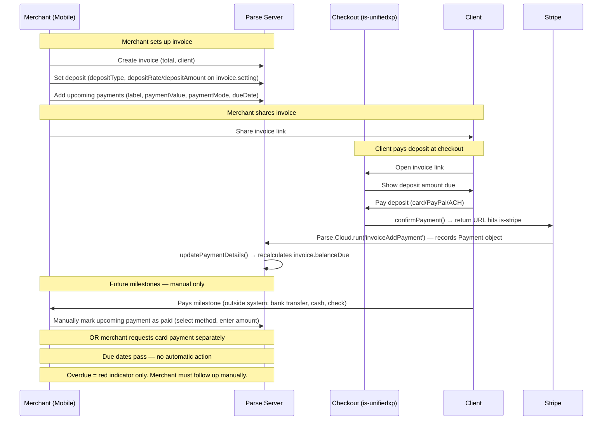
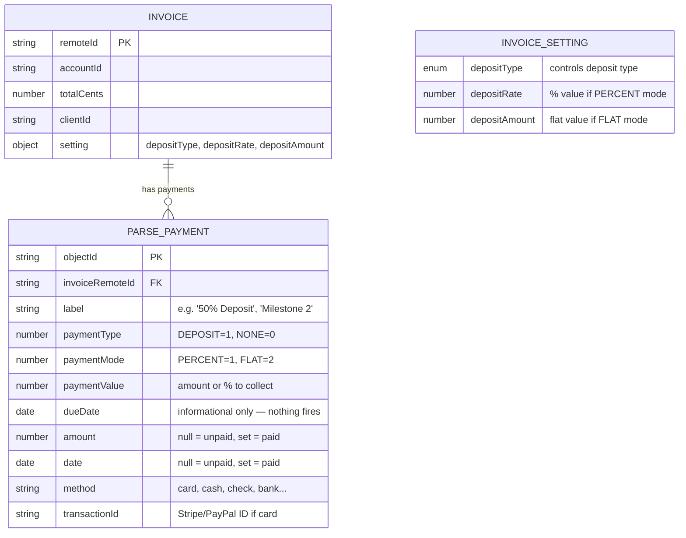
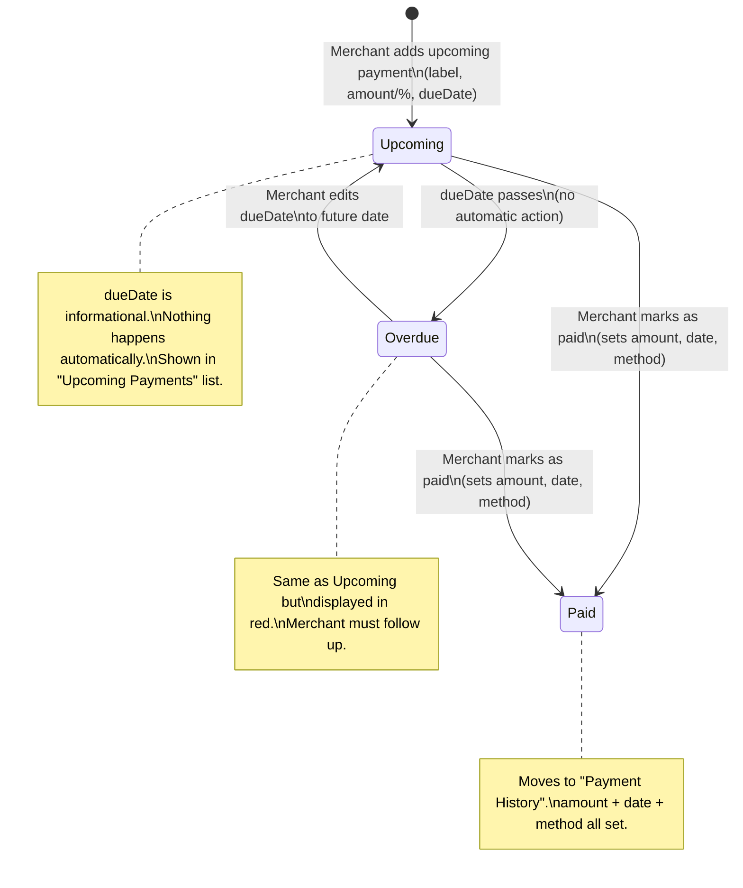
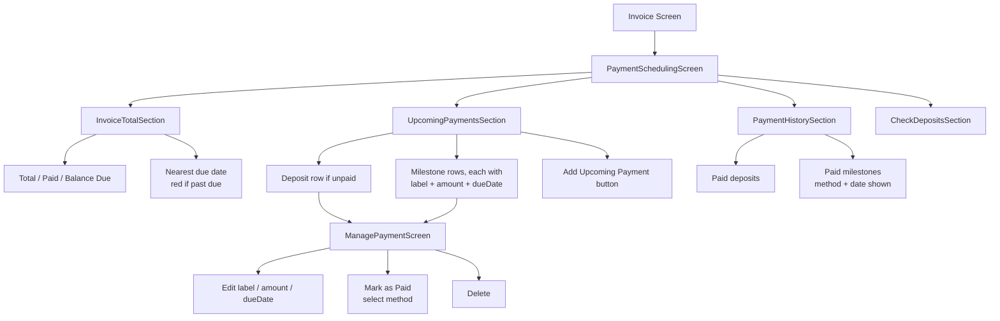
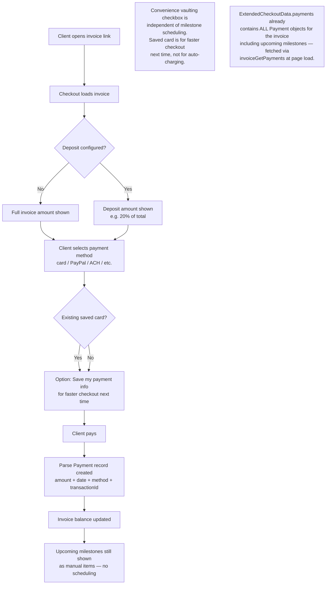
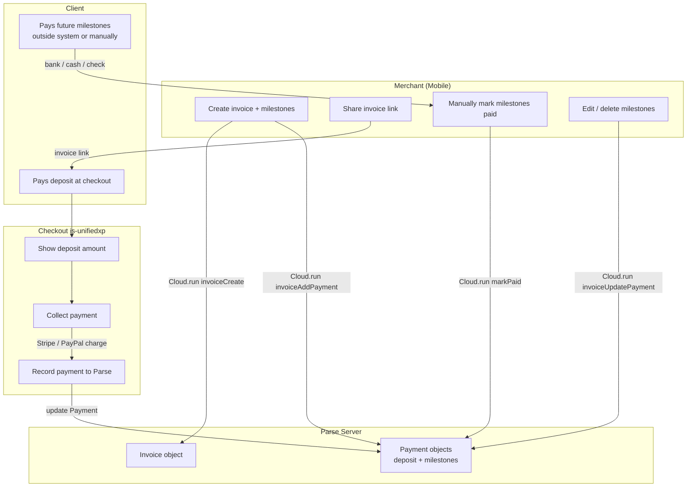

# Diagrams: Payment Scheduling — Current State (Before Auto-Pay)

> **Purpose:** Baseline "before" diagrams for the Deposits & Milestones feature as it exists
> today — no automatic charging, no vaulting, no EventBridge. Due dates are purely informational.
> These diagrams pair with the "after" diagrams in:
> - `2026-05-04-deposits-milestones-auto-payments-diagrams.md` (with explicit toggle)
> - `2026-05-07-diagrams-implicit-eligibility-variant.md` (with implicit eligibility)

---

## Current Flow Overview

---

## Data Model (Current)

Note: A payment is **unpaid** when `amount` and `date` are null. It is **paid** when both are set.
There is no explicit `status` field — state is inferred from data shape.

---

## Milestone States (Current)

---

## Merchant Mobile UI Structure (Current)

---

## Checkout Flow (Current — Deposit Only)

---

## Data Flow Summary (Current)

---

## Before vs. After: Key Differences

| Aspect | Before (today) | After (with auto-pay) |
|--------|---------------|----------------------|
| Due dates | Informational only | Trigger real charges |
| Client at checkout | Pays deposit, nothing else | Pays deposit + optionally vaults card |
| Future milestones | Manual follow-up by merchant | Auto-charged on due date |
| Payment method storage | Convenience vault (optional, for faster checkout) | Auto-pay vault (explicit consent to charge) |
| Overdue milestones | Red indicator only | Charged immediately at vault time |
| Merchant action needed | Follow up for every milestone | Only needed on failure |
| New backend services | None | is-stripe vault table, is-payments schedules, EventBridge, SQS, Lambdas |
| Parse changes | None | None (auto-pay state lives in is-stripe + is-payments) |
| Checkout milestone data | `payments[]` already in `ExtendedCheckoutData` (fetched via `invoiceGetPayments`) | Same — no new fetch needed for eligibility check or post-payment schedule cancellation |

---

## Implementation Notes

### How Checkout Records a Payment to Parse (verified in code)

Checkout does **not** call Parse directly. The full chain:

1. **is-unifiedxp** — client pays via Stripe Elements (`confirmPayment()`). The return URL points to is-stripe: `{IS_STRIPE_SERVICE_URL}/payment-intent/confirm/:documentId`
2. **is-stripe** (`routes/public/payment-intent-confirm.ts:159`) — detects success, calls `addPaymentToDocument()`
3. **is-stripe** (`services/document-add-payment.ts:17` → `services/invoice-payments.ts:40`) — calls `invoiceAddPayment()` on Parse
4. **is-stripe** (`utils/parse/public-invoice.ts:164`) — `Parse.Cloud.run('invoiceAddPayment', { invoiceId, payment }, { useMasterKey: true })`
5. **Parse Server** (`cloud/collections/invoice/functions/invoiceAddPayment.ts:111`) — creates Payment object, calls `addPaymentToInvoice()`
6. **Parse Server** (`cloud/collections/invoice/utils/updatePaymentDetails.ts:13`) — recalculates and saves `invoice.balanceDue` via `getInvoiceBalance()` from `@invoice-simple/calculator`

**Key point:** `invoice.balanceDue` is updated automatically as a side effect of `invoiceAddPayment` — there is no separate "update balance" call. The same chain fires whether payment is recorded via checkout (is-stripe → Parse) or by merchant marking paid manually (mobile → Parse.Cloud.run directly).
