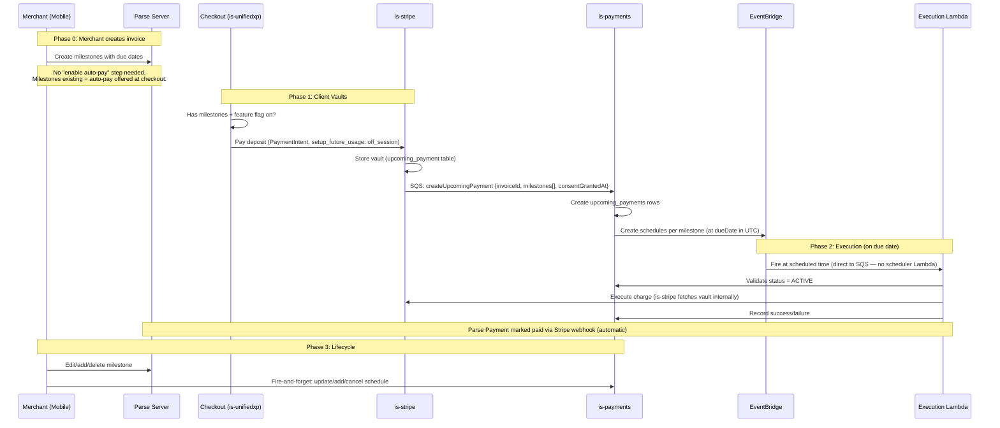
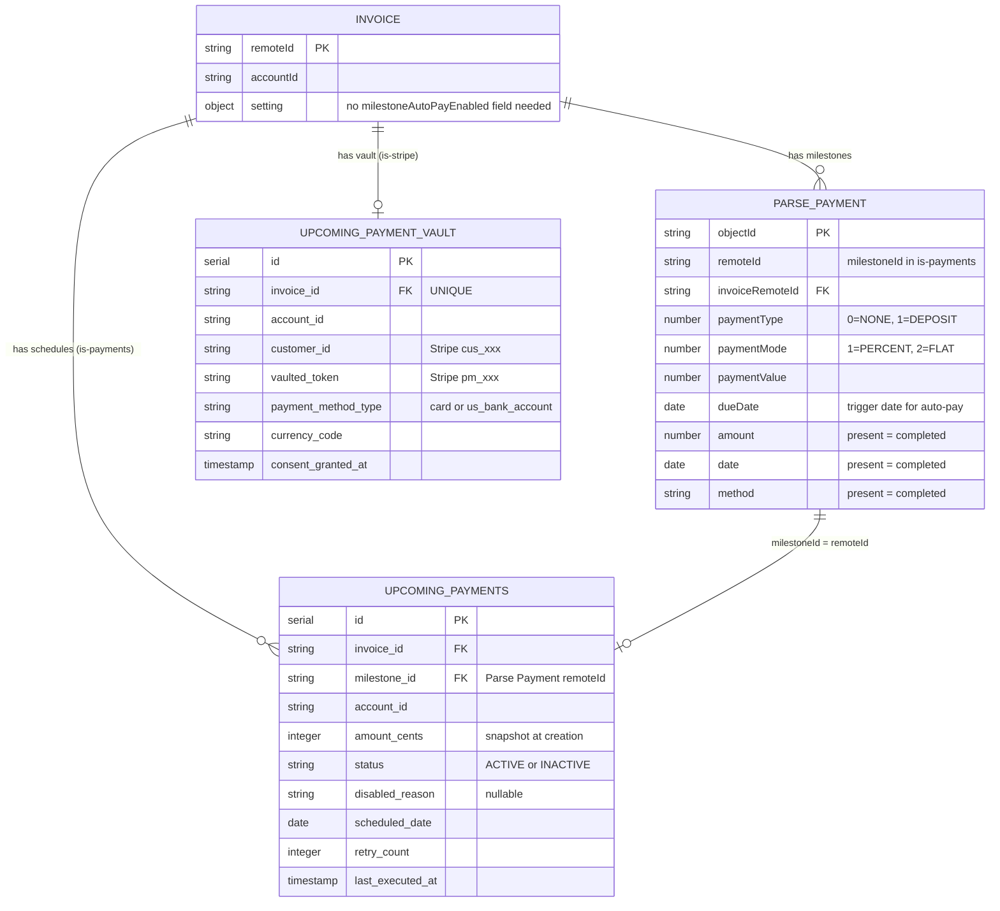
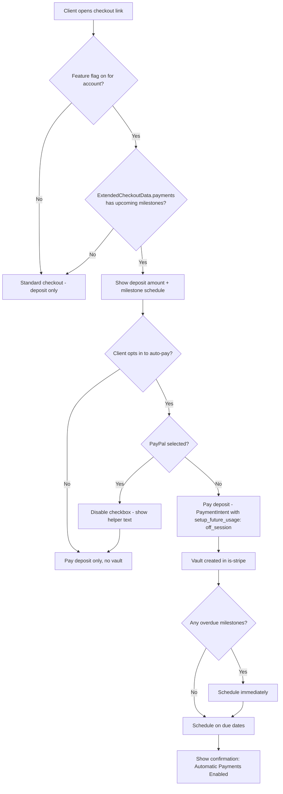
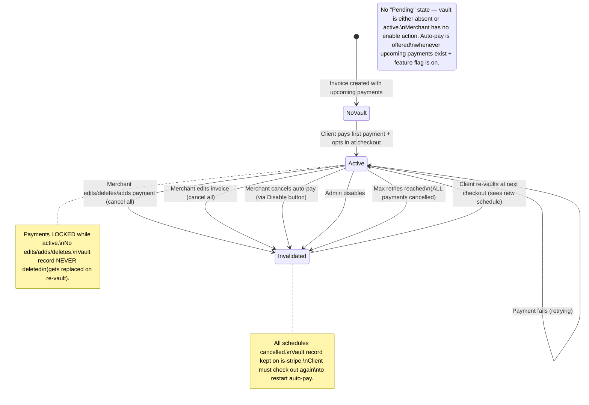
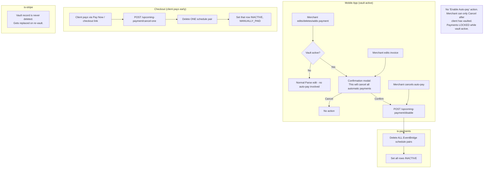

# Diagrams: Implicit Eligibility Variant (Option E)

> **Context:** These diagrams reflect the design variant where auto-pay eligibility is derived
> implicitly from the presence of milestones, rather than an explicit `milestoneAutoPayEnabled`
> flag on the invoice. See Decision 9 (Alternative E) in decisions.md.
>
> **What changes vs. base diagrams:**
> - Phase 0 (merchant enables flag) is removed — no merchant action needed to offer auto-pay
> - Checkout eligibility check is "has future milestones?" not "is flag set?"
> - Vault state machine has no "Pending" state — vault goes directly NoVault → Active
> - ER diagram removes `milestoneAutoPayEnabled` from Invoice
> - Merchant lifecycle: no "enable" action, only "disable" (cancel after vault)
>
> **What stays the same:** All backend infrastructure, execution flow, retry logic, emails,
> AWS resources, data model tables, and API contracts are identical.

---

## End-to-End Flow Overview



---

## Data Model Relationships



Note: `INVOICE.setting.milestoneAutoPayEnabled` is removed. Auto-pay eligibility is determined
entirely by: (1) invoice has upcoming milestones with due dates, and (2) feature flag is on for
the account. Vault record existing = auto-pay is active.

---

## Checkout UI Flow (Client Side)



---

## Vault Lifecycle State Machine



---

## Merchant Lifecycle Actions (Mobile) — Implicit Variant, Locked After Vault



---

## Eligibility Signal Comparison

```
OPTION B (explicit toggle — base design):
─────────────────────────────────────────
Checkout gate:  invoice.setting.milestoneAutoPayEnabled === true
                AND feature flag on
                AND has milestones

Merchant flow:  Create invoice → add milestones → flip toggle → send invoice
                Client sees auto-pay opt-in at checkout

Mobile UI:      Toggle in invoice settings + status indicator + cancel button

Parse changes:  New field (invoice.setting.milestoneAutoPayEnabled)


OPTION E (implicit — this variant):
─────────────────────────────────────────
Checkout gate:  checkoutData.payments.filter(upcoming milestones).length > 0
                AND feature flag on
                (payments[] is ALREADY in ExtendedCheckoutData — no extra fetch needed)

Merchant flow:  Create invoice → add milestones → send invoice
                Client sees auto-pay opt-in at checkout automatically

Mobile UI:      Status indicator + cancel button only (no toggle)

Parse changes:  None
Checkout cost:  None — milestone data already in ExtendedCheckoutData.payments[]
```

> **Implementation note (updated 2026-05-08):** Earlier analysis flagged a hidden cost for
> Option E (milestone data not available at checkout). This was incorrect. `ExtendedCheckoutData`
> already includes `payments[]` — the full list of Payment objects for the invoice, fetched via
> `invoiceGetPayments` in `getDocumentData()`. Filtering for upcoming milestones is a trivial
> array filter on already-loaded data. Option E and Option B are equally simple at the checkout
> layer. The real tradeoff is product behavior (all milestone invoices opt-in vs. per-invoice
> merchant control), not implementation cost.
