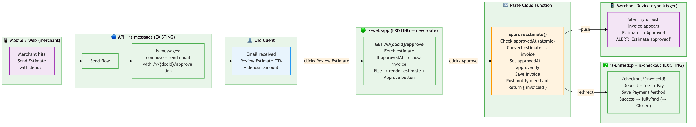

# Estimate Auto-Accept Link — Feasibility Research

**Date:** 2026-06-11 (updated 2026-06-17)
**Status:** Research / Seth prototypes received — architecture simplified after Juan sync
**PRD Reference:** [Deposits Optimizations PRD](https://everpro-tech.atlassian.net/wiki/spaces/PM/pages/1213300774/Deposits+Optimizations+PRD)
**Dip's proposal:** Create a one-time unique link → client clicks → estimate maps to invoice → conversion runs automatically.
**Seth's prototype:** 6-screen flow — email → estimate view → approve → deposit checkout → card vault → success.

---

## Flow Comparison

### Original Plan (from Dip's proposal)

```
1. Merchant sends estimate (with "Request Mandatory Card on File" enabled)
2. System generates one-time token → email with accept link
3. Client clicks link → hits endpoint (GET /accept?token=abc123)
4. Server validates + consumes token (atomic, single step)
5. Server converts estimate → invoice (server-side)
6. Server redirects client → card vaulting → deposit checkout
7. Server sends silent sync push to merchant
8. Merchant's app syncs
```

Client clicks one link → conversion + payment happen in one shot. Client never "sees" the estimate — just lands on checkout.

### Seth's Prototype Flow (6 screens)

```
1. Merchant sends estimate (with deposit configured)
2. System generates link → email shows deposit amount + "Review Estimate" CTA
3. Client clicks "Review Estimate" → lands on public estimate view page (NEW)
4. Client reads the full estimate (line items, totals, deposit amount)
5. Client clicks "Approve Estimate" button
6. Server validates + consumes token (atomic)
7. Server converts estimate → invoice (server-side)
8. Client lands on checkout — deposit amount + online fee shown, picks payment method
9. Client checks "Save Payment Method" → sees authorization for remaining balance
10. Client pays deposit
11. Success page confirms deposit paid + card saved for remaining balance
12. Server sends silent sync push to merchant
```

Client reviews first, explicitly approves, then pays. Three distinct steps visible to the client.

### Key Differences

| | Original plan | Seth's prototype |
|---|---|---|
| **Client sees estimate?** | No — skips straight to checkout | Yes — full view page first |
| **Approval is explicit?** | No — clicking link = acceptance | Yes — separate "Approve" button |
| **Conversion trigger** | Link click | Approve button click |
| **Steps for client** | 1 (click → pay) | 3 (view → approve → pay) |
| **New pages needed** | Accept endpoint only | Estimate viewer + approve endpoint + checkout |
| **Vaulting consent** | Implicit | Explicit checkbox + authorization text with remaining balance |
| **Deposit shown in email** | Not specified | Yes — "DEPOSIT USD $100.00" in email |

**Key insight:** This isn't just "convert and view" — it's **vault card + convert + charge deposit**. The conversion is sandwiched between two payments operations. Seth's prototype makes this explicit to the client with clear authorization language.

### Seth's Prototype Screens (summary)

1. **Email** — Shows estimate number, date, total ($500), deposit amount ($100), "Review Estimate" CTA
2. **Estimate view** — Full public estimate page on invoicesimple.com with "Approve Estimate" button (+ PDF/Print options)
3. **Payment form** — Deposit $100 + online payment fee $3.49 = $103.49, card fields
4. **Payment methods** — US Bank, Pay Later, PayPal, Apple Pay, Link, Google Pay + "Save Payment Method" checkbox
5. **Save card auth** — "Acme Landscaping will be authorized to charge your selected payment method for this invoice's remaining balance. Balance: $413.96"
6. **Success** — Deposit paid confirmed + "Payment Method Saved" with authorization details (amount, method, contact to modify)

---

## Current State

### Estimate-to-Invoice Conversion (Today)

The conversion is **entirely client-side** — no backend endpoint exists.

| Platform | Entry Point | Core Logic |
|----------|-------------|------------|
| Web | `ConvertToInvoiceButton.tsx` | `InvoiceModel.convertEstimate()` → `_convertEstimateData()` |
| Mobile | `convert-estimate-to-invoice-modal.tsx` | `makeInvoiceFromEstimate()` in realm use-cases |

**Field mapping summary:**
- `docType` flips from ESTIMATE (1) → INVOICE (0)
- New `remoteId` assigned (new document identity)
- `estimateId` set on invoice settings (back-reference)
- Estimate-specific fields stripped (`estimateSignatureRequired`, etc.)
- Items, client, company, photos, signature preserved
- Totals recalculated

**Payments are runtime-determined** — any invoice with `balanceDue > 0` and payment not suppressed is automatically payable. No explicit "enable payments" step needed after conversion.

### Link/Share Infrastructure (Today)

| Pattern | Purpose | Auth | Tracking |
|---------|---------|------|----------|
| `/vm/{msgId}/{invoiceNo}` | Mobile share (tracked) | None | `msg` table, open events |
| `/vm/{msgId}/{invoiceNo}?p=1` | Share + payment redirect | None | Same + payment_viewed |
| `/v/{documentId}` | Web public link | None | hashids → msg_archive |

Links are permanent (no expiry), identified by UUID obscurity, and tracked via the `msg` PostgreSQL table.

---

## Proposed Flow

```
Merchant                          System                              Client
   |                                |                                    |
   |-- "Send Estimate" ------------>|                                    |
   |   (with auto-accept enabled)  |                                    |
   |                                |-- Generate one-time link --------->|
   |                                |   /accept-estimate/{token}         |
   |                                |                                    |
   |                                |<--- Client clicks link ------------|
   |                                |                                    |
   |                                |-- Validate token (exists,          |
   |                                |   not expired, not used)           |
   |                                |                                    |
   |                                |-- Convert estimate → invoice       |
   |                                |   (server-side, is-services)       |
   |                                |                                    |
   |                                |-- Mark token consumed              |
   |                                |                                    |
   |                                |-- Redirect to checkout ----------->|
   |                                |   /checkout/{invoiceId}            |
   |                                |                                    |
   |<-- Notification: "Estimate     |                                    |
   |    accepted, invoice created"  |                                    |
```

---

## Architecture & Service Boundaries

### Proposed Code Split (simplified after Juan sync — 2026-06-17)

```
is-web-app/
  nextjs/app/(public)/v/[documentId]/
    approve/page.tsx                    ← NEW route: renders estimate + "Approve Estimate" button
                                           If already approved → shows public invoice (redirect or inline)

is-parse-server/
  cloud/functions/
    approveEstimate.ts                  ← NEW Parse Cloud Function
                                           - validates approvedAt (guard)
                                           - converts estimate → invoice (logic lives here)
                                           - sets approvedAt + approvedBy on estimate
                                           - saves new invoice
                                           - returns { invoiceId } for redirect to checkout

is-services/
  packages/services/is-unifiedxp/       ← ALREADY EXISTS (Next.js customer-facing UI)
    src/app/checkout/[documentId]/
      page.tsx                          ← payment form (screens 3-5 of Seth's prototype)
      success/page.tsx                  ← success page (screen 6)

  packages/services/is-checkout/        ← ALREADY EXISTS (Express backend API)
    src/checkout/                        ← payment intent creation, eligibility, orchestration
```

**Key simplification (Juan):** No new `is-estimates` microservice. No `@is/common` shared package extraction. All conversion logic lives in a Parse Cloud Function — same pattern as other server-side document operations. The is-web-app approve page calls the cloud function directly.

### Service Roles (simplified after Juan sync — 2026-06-17)

| Service | Type | Role | Seth's prototype screens |
|---------|------|------|------------------------|
| `is-web-app` (exists, new route) | Next.js | `/v/{documentId}/approve` — renders estimate view + "Approve" button | Screen 2 (estimate view) |
| Parse Cloud Function (NEW) | Cloud Function | `approveEstimate` — validates state, converts, saves invoice, returns invoiceId | — (backend logic) |
| `is-unifiedxp` (exists) | Next.js | Customer-facing checkout UI — payment form, methods, success | Screens 3-6 (payment → success) |
| `is-checkout` (exists) | Express | Backend payment API — intent creation, eligibility checks | Backend for screens 3-6 |
| `is-payments` (exists) | Express | Payment methods, recurring payment orchestration | Card vaulting / `setup_future_usage` |

**Removed:** `is-estimates` microservice and `@is/common` shared package — conversion logic lives directly in the Parse Cloud Function.

### Request Flow (simplified after Juan sync — 2026-06-17)

```
Email "Review Estimate" CTA
  → is-web-app: /v/{documentId}/approve (NEW route on existing public page infra)
    → fetch estimate from Parse (existing pattern)
    → check approvedAt — if set → show public invoice page (works out of the box)
    → otherwise → render estimate view + email input + "Approve Estimate" button

"Approve Estimate" button click
  → Parse Cloud Function: approveEstimate({ documentId, email? })
    → fetch estimate, check approvedAt (guard against double-approve)
    → set approvedAt + approvedBy { email, timestamp }
    → convert estimate → invoice (logic inside cloud function)
    → save new invoice to Parse
    → send silent sync push + ALERT push to merchant
    → return { invoiceId } → client-side redirect to checkout

Checkout + Payment (deposit paid)
  → is-checkout: payment confirmation webhook / callback
    → mark estimate fullyPaid: true (→ "Closed")

Checkout + Payment
  → is-unifiedxp: /checkout/{invoiceId} (already exists)
    → shows deposit amount + fee
    → payment methods (Card, Bank, PayPal, Apple Pay, Link, Google Pay)
    → "Save Payment Method" checkbox → Stripe setup_future_usage
    → Pay Now → is-checkout backend creates PaymentIntent
    → success page shows deposit paid + card authorized for remaining balance

Already-approved re-visit (Juan's insight)
  → Client clicks same link again after approval
  → is-web-app: /v/{documentId}/approve detects approvedAt is set
  → Shows public invoice page with "Pay Online" button → checkout
  → Works out of the box — invoice is already a public document at /v/{invoiceId}
```

**Why no token table:** The estimate's own state (`approvedAt`) is the single-use guard — once set, approval can't happen again. Expiry can be checked against when the estimate was sent. Invalidation on edit is handled by checking estimate's `updatedAt` vs a threshold. No separate token infrastructure needed.

**Why no new microservice (Juan):** Parse Cloud Functions are the existing pattern for server-side document operations. A whole microservice for one endpoint is over-engineering. The cloud function has direct access to Parse/Mongo — no extra data-fetching layer needed.

### Architecture Diagram



(Source: [estimate-accept-flow.mmd](./diagrams/estimate-accept-flow.mmd))

### Bulleted Flow Summary

**Mobile / Web (merchant)**
- Merchant hits "Send Estimate" with deposit configured

**API + is-messages (EXISTING)**
- Send flow composes email with `/v/{documentId}/approve` link embedded
- No token generation step needed — documentId is the identifier

**End Client (estimate recipient)**
- Receives email showing deposit amount + "Review Estimate" CTA

**is-web-app — NEW ROUTE on existing public page infra**
- `/v/{documentId}/approve` — fetches estimate, checks state (`approvedAt`), renders estimate view page with "Approve Estimate" button + optional email input
- If already approved → shows "Already approved" message + link to checkout
- Client reviews full estimate (line items, totals, deposit)
- Client clicks "Approve Estimate"

**Parse Cloud Function `approveEstimate` (NEW — replaces is-estimates service + @is/common)**
- Called from is-web-app approve page: `approveEstimate({ documentId, email? })`
- Checks `approvedAt` (double-approve guard via atomic findOneAndUpdate)
- Sets `approvedAt` + `approvedBy { email?, timestamp }` on estimate
- Converts estimate → invoice (conversion logic lives directly in cloud function)
- Saves new invoice to Parse
- Sends silent sync push + ALERT push to merchant
- Returns `{ invoiceId }` for client-side redirect to checkout

**is-unifiedxp + is-checkout (EXISTING)**
- `/checkout/{invoiceId}` — deposit amount + online fee, all payment methods (Card, Bank, PayPal, Apple Pay, Link, Google Pay)
- "Save Payment Method" checkbox — authorization text for remaining balance, Stripe `setup_future_usage`
- "Pay Now" — is-checkout backend creates PaymentIntent + SetupIntent
- `/checkout/{invoiceId}/success` — deposit paid confirmed + card authorized for remaining balance

**Merchant Device — NEW: sync trigger + notifications for estimate acceptance**
- Silent sync push received (push infra exists, but this trigger point is new)
- New invoice appears in list
- Estimate moves to **"Approved"** state (`approvedAt` set, `fullyPaid` still false — client has approved but not yet paid)
- Estimate only moves to **"Closed"** (`fullyPaid: true`) after deposit payment is confirmed in checkout
- Visible ALERT push notification: "Your estimate was approved!" (confirmed by Seth — needed for when merchant is not in-app)
- In-app messaging linking estimate → converted invoice (confirmed by Liz — merchant needs to see what happened and navigate to the new invoice)

### Flow Mapped to Endpoints

| Step | Client action | Endpoint | Service | What happens |
|------|--------------|----------|---------|--------------|
| Send | Merchant hits "Send Estimate" | (existing send flow) | is-messages (exists) | Composes email with `/v/{documentId}/approve` link |
| Email click | "Review Estimate" | `GET /v/{documentId}/approve` | is-web-app (exists, new route) | Fetch estimate, check `approvedAt`. If approved → show public invoice. Otherwise → render view page + "Approve" button |
| Approve | "Approve Estimate" button | Parse Cloud Function `approveEstimate({documentId, email?})` | is-parse-server (exists, new function) | Check `approvedAt`, set it + `approvedBy`, convert → invoice, save, push notify, return `{ invoiceId }` |
| Redirect | Client-side | `/checkout/{invoiceId}` | is-unifiedxp (exists) | Existing checkout page — deposit amount + fee, payment methods |
| Pay | "Pay Now" | (existing checkout POST) | is-checkout (exists) | Stripe PaymentIntent + SetupIntent for future charges |
| Success | — | `/checkout/{invoiceId}/success` | is-unifiedxp (exists) | Show deposit paid + authorization for remaining balance |
| Re-visit | Client clicks link again | `GET /v/{documentId}/approve` | is-web-app | Detects `approvedAt` set → shows public invoice with "Pay Online" button (works out of the box) |

### Why this split (Dip + Juan guidance)

- Dip explicitly said: "I would not keep it in checkout or payments or anything payments related. It doesn't belong there."
- The conversion logic is core document logic, not a payments operation
- Juan: a whole microservice for one endpoint is over-engineering — Parse Cloud Function is the right pattern for server-side document operations
- Cloud function has direct Mongo access — no extra data-fetching layer needed
- `is-unifiedxp` and `is-checkout` already handle everything post-conversion (payment form, intent creation, vaulting, success)
- is-web-app already renders public documents — just add the approve route there

### What's New vs What Exists

**Build new:**
1. Parse Cloud Function `approveEstimate` (validates state, converts estimate → invoice, returns invoiceId)
2. `/v/{documentId}/approve` route in is-web-app (new Next.js page — reuses existing public document components, adds "Approve" button + email input)
3. Email template update (add deposit amount + "Review Estimate" CTA with `/v/{documentId}/approve` link)
4. "Approved" state on estimates — new field `setting.approvedAt: Date` + `setting.approvedBy: { email?, timestamp }` (backwards-compatible)
5. Visible ALERT push notification for "estimate approved" (new event type + copy)
6. In-app message linking estimate → converted invoice (new notification type)
7. (Optional) `convertedTo: invoiceId` field on estimate if we want to link them

**Already exists (reuse as-is):**
- `is-unifiedxp` checkout page (screens 3-5 — payment form, all methods)
- `is-unifiedxp` success page (screen 6 — with minor copy additions)
- "Save Payment Method" / Stripe `setup_future_usage: 'off_session'`
- Online payment fee calculation
- Silent sync push (`isMsg.pushNotification.sync()`)
- All payment methods (Card, Bank, PayPal, Apple Pay, Google Pay, Link)
- Push notification infra (ALERT type — same as "Payment received" today)
- In-app notification/messaging infra (is-messages)

**Minor modifications to existing:**
- `is-unifiedxp` checkout may need a `deposit=true` mode to show deposit amount vs full balance
- `is-unifiedxp` success page needs vaulted card authorization blurb ("authorized to charge $413.96")
- Mobile/web need to handle new "Approved" state on estimates (UI for the state, probably a badge or tab)

---

## Estimate Lifecycle (NEW — from Liz's feedback 2026-06-16)

Liz confirmed that we need a new "Approved" state on estimates. Today estimates are binary (Open / Closed via `fullyPaid`). With the accept link flow, there's a meaningful middle state.

### Current "Make Invoice" Behavior (verified 2026-06-17)

**Finding: The estimate is NOT marked after manual conversion.**

Tested on mobile: after "Make Invoice", the estimate record in Parse only gets an `updated` timestamp bump — no `fullyPaid: true`, no state change. The estimate stays fully open and can be converted again (unlimited invoices from the same estimate).

**Possible bug/gap:** Code in all four conversion paths (web React, web Next.js, mobile list, mobile navigator) explicitly sets `setting.fullyPaid = true` on the estimate, but it's **not persisting to Parse**. Likely a sync issue — Realm sets it locally but it gets overwritten on next sync, or the save order is wrong. This means:
- The "Closed" state for estimates via `fullyPaid` may be effectively broken today
- No guard exists against double-conversion — merchants can make 3+ invoices from the same estimate
- `fullyPaid` on estimates is unreliable as a state indicator

**Team consensus (Slack thread 2026-06-17):**
- Liz: "In theory, you could simply update a single Estimate and convert it to a new Invoice each time" — valid contractor workflow (reusable estimates)
- Juan/Seth/Liz agree: merchant-initiated conversion stays as-is (unlimited, no guard)
- Buyer-flow enforces 1:1 via `approvedAt` (new field)
- **If product ever wants unique conversion:** just update `docType` + `title` on the estimate in-place (same Mongo collection — invoices and estimates share the Invoice collection, just different `docType`). No migration needed.
- **If we need to link estimate → invoice:** add a `convertedTo: invoiceId` field on the estimate (adding a field to a collection is straightforward)

### Proposed Estimate States

| State | Trigger | What merchant sees | Estimate field |
|-------|---------|-------------------|----------------|
| **Open** | Estimate created / sent | In "Open" tab, waiting for client response | no `approvedAt`, `fullyPaid` unreliable |
| **Approved** (NEW) | Client clicks "Approve Estimate" via link | In "Approved" tab or badge, invoice created but deposit not yet paid | `approvedAt: timestamp` |
| **Closed** | Deposit payment received | In "Closed" tab, fully converted + paid | `fullyPaid: true` (if we fix the persistence bug) |

### Implementation Decision: `approvedAt` field (Option A — decided 2026-06-16)

Current codebase has **no status enum on estimates** — state is supposedly derived from `setting.fullyPaid`, but this field is not reliably set (see bug/gap above).

This is defined in `is-packages/packages/domain-invoicing/src/document/estimate.ts` (EstimateSettings type) and queried in `is-services/packages/domain-model/is-document/src/pagination/filter.ts`.

**Decision: add `setting.approvedAt: Date | undefined`** — minimal, backwards-compatible change:
- Open = no `approvedAt`
- Approved = `approvedAt: Date` (set by approve link flow)
- Closed = `fullyPaid: true` (set when deposit is actually paid — needs the persistence bug fixed)

`approvedAt` also serves as the **single-conversion guard** for the approve link flow — the first real enforcement that an estimate can only be converted once via this path. (The manual "Make Invoice" path remains unguarded — existing behavior.)

**Files that need changes:**
1. `is-packages/packages/domain-invoicing/src/document/estimate.ts` — add `approvedAt` to EstimateSettings
2. `is-parse-server/cloud/collections/invoice/invoiceValidation.ts` — allow new field
3. `is-services/packages/domain-model/is-document/src/pagination/filter.ts` — add Approved filter
4. Mobile Realm schema — add field + sync
5. Mobile/Web UI — tab filtering, list display, badge for "Approved" state

**Why not a status enum:** Would require backfilling all existing estimates, dual-source-of-truth risk with `fullyPaid`, and touches far more files across mobile Realm schema, Parse validation, and web models.

### "Approved but Unpaid" State

This is the gap between client clicking "Approve" and completing checkout payment:

**What exists at this point:**
- Estimate: `approvedAt` set (can't re-approve)
- Estimate: marked "Approved" (NEW state), NOT fullyPaid yet
- Invoice: created in Parse, synced to merchant, with deposit due
- Payment: not collected — client is on checkout page or abandoned it

**Why this matters:**
- Merchant gets notified "estimate approved" but no money yet
- Invoice exists as a normal unpaid invoice with `balanceDue > 0`
- Client can return to `/checkout/{invoiceId}` at any time — it's a standard checkout URL (no token needed)
- If client abandons checkout forever → merchant has an unpaid invoice (same as sending any invoice that never gets paid)

**How client gets back to pay if they abandoned:**
- The checkout URL is permanent (same as any invoice checkout link)
- Could bookmark it, or merchant could resend the invoice link
- Product question: should we send a reminder email if checkout is abandoned? (v2)

**What notification to send at each stage:**

| Event | Notification type | Copy | Existing pattern? |
|-------|------------------|------|-------------------|
| Client approves estimate | ALERT push + in-app message | "Tomás approved your estimate! View invoice →" | Yes — similar to "Payment received" push |
| Client completes deposit payment | ALERT push + in-app message | "Deposit of $100 received from Tomás" | Yes — existing payment notification |
| Client abandons checkout | None (v1) / Reminder email (v2) | — | — |

---

## Merchant Notification Details (from Liz + Seth — 2026-06-16)

### What Liz said:
> "Possible add messaging in-app for the merchant to know that the estimate has been approved and link it to the converted invoice."

### What Seth said:
> "This is a great idea. I think it would make sense to use push notifs to communicate this too"
> "e.g. if the estimate is approved while they're not in the app"

### Implementation (all existing patterns):

**1. Silent sync push (data)**
- `isMsg.pushNotification.sync({ accountId, full: false })` — one-liner
- Triggers `syncStore.sync()` on mobile → new invoice appears in list, estimate status updates
- Pattern: used by bookkeeping, stripe, paypal, recurring invoices, document restore, expense OCR
- No visible notification — just data refresh

**2. Visible ALERT push notification (user-facing)**
- `isMsg.pushNotification.alert({ accountId, title, body, data })` or similar
- Shows banner/notification tray: "Your estimate EST0001 was approved by Tomás!"
- Tap → deep link to the converted invoice
- Pattern: used by "Payment received" notifications today
- Payload needs: `invoiceId` (to navigate to), `estimateId` (to show context)

**3. In-app message linking estimate → invoice**
- Show in a notifications/activity feed or as a banner on the estimate itself
- "This estimate was approved → View Invoice INV0014"
- Pattern: existing `is-messages` / notification infrastructure
- Could be implemented as:
  - A notification row in existing notifications list
  - A status banner on the estimate detail screen
  - Both (notification to attract attention, banner for persistence)
- Product decision: which approach? (Ask Seth for designs)

### Technical complexity: LOW
All three mechanisms exist today. New work is:
- Define new event type/copy for "estimate approved"
- Define deeplink payload (which screen to open, which document)
- Wire the trigger in `POST /estimates/approve` handler (after successful conversion)

---

## Public Estimate View Page (Screen 2 of Seth's Prototype)

### What it shows (from Seth's prototype):
- Estimate number (EST0001)
- Date
- Merchant logo + company name + business number + address + contact
- Client name + phone + email ("TO" section)
- Line items (description, rate, qty, amount)
- Total
- Deposit amount
- "Approve Estimate" button (primary CTA)
- PDF + Print buttons (secondary)
- "Powered by Invoice Simple" footer

### Key Finding: Public estimate view ALREADY EXISTS (updated 2026-06-17)

**A public estimate view page already exists** at the same route as invoices:

| Component | Location |
|-----------|----------|
| Next.js page | `is-web-app/nextjs/app/(public)/v/[documentId]/page.tsx` |
| Feature component | `is-web-app/nextjs/app/(public)/v/[documentId]/public-document.feature.tsx` |
| Document type detection | Checks `docType === DocTypes.DOCTYPE_ESTIMATE` at runtime |
| Estimate signature modal | `estimate-signature-modal.tsx` — already renders for estimates |
| Express route | `is-web-app/server/app.ts` — `/v/:id` |
| URL pattern | `/v/{documentId}` — same for both invoices and estimates |

Both invoices and estimates use the **same `/v/{documentId}` route**. The component detects the document type at render time and renders accordingly (e.g., shows signature modal for estimates when `estimateSignatureRequired` is true).

### Revised Approach: Reuse is-web-app's public view page

Instead of building a new EJS page in is-estimates, **reuse the existing public estimate page in is-web-app** and add the "Approve Estimate" button as a new affordance:

```
Email "Review Estimate" CTA
  → is-estimates: GET /view?token=abc
    → validate token (NOT consumed)
    → redirect to is-web-app: /v/{documentId}?approve=true&token=abc

Client sees existing public estimate page + "Approve Estimate" button (shown when ?approve=true)
  → Client clicks "Approve Estimate"
  → is-web-app calls is-estimates: POST /approve { token }
    → consume token, convert, redirect to checkout
```

**Benefits:**
- No new rendering — reuse existing Next.js page with full branding, responsive design, PDF/Print
- Consistent styling with the rest of the public document experience
- `is-estimates` stays focused: token lifecycle + conversion only, no rendering responsibility
- Existing page already handles data fetching from Parse, merchant branding, mobile responsiveness

**What's new on the existing page:**
- "Approve Estimate" button (conditionally shown when `?approve=true` query param present)
- API call to `POST /estimates/approve` on button click
- "Already approved" state handling (if token already consumed)
- "Link expired" state handling

**Data fetching:** Not needed in is-estimates for rendering — is-web-app already fetches the full document from Parse/Mongo for the public view. is-estimates only needs to fetch the document at approval time (for conversion).

### Remaining Considerations:

**1. PDF/Print buttons**
- Already exist on the public view page? If not, can add as part of the "Approve" button work
- Not a blocker — page already shows the full estimate

**2. Security**
- Token in URL = only auth. Anyone with the link sees the estimate.
- Same security model as existing invoice share links (UUID obscurity)
- Estimate content (line items, client name, amounts) is visible to anyone with the URL
- Acceptable — same tradeoff we make today for invoice viewing

---

## Connection to Deposit Vaulting Flow

The "Save Payment Method" checkbox + `setup_future_usage` in Seth's prototype (screens 4-5) is the **entry point to the deposit vaulting flow** documented in [deposit-vaulting-flow-summary.md](./deposit-vaulting-flow-summary.md).

### What happens if client skips the checkbox (no vault)

If the client pays the deposit without checking "Save Payment Method":
- Deposit charged via a standard `PaymentIntent` (no `setup_future_usage`)
- Card is NOT vaulted — no `SetupIntent`, no stored payment method
- Success page just confirms deposit paid (no authorization blurb)
- Invoice sits with `balanceDue > 0` like any normal unpaid invoice
- Merchant cannot charge remaining balance off-session — must chase client manually
- Merchant-initiated and Buyer-initiated charge flows are unavailable for that transaction

**Open product question:** Should the checkbox be opt-out (checked by default) rather than opt-in? If the whole point is enabling the merchant to charge the rest later, an optional unchecked default means that guarantee isn't always there. To be discussed with Liz/Seth.

### What happens if client checks the checkbox (vault + both charge paths)

Mechanics are identical to Recurring Payments:

**At checkout (deposit payment):**
- `PaymentIntent` with `setup_future_usage: 'off_session'`
- Stripe charges the deposit AND stores the payment method in one shot
- Returns a `SetupIntent` / `PaymentMethod` ID → saved to the account/invoice record

**Merchant-initiated charge (off-session — same as RP):**
- Merchant taps "Charge Remaining Balance" in the app
- `PaymentIntent.create({ payment_method: savedPmId, off_session: true, confirm: true })`
- Same Lambda/SQS pattern as RP scheduled charges
- Client doesn't need to do anything

**Buyer-initiated charge (on-session):**
- Client returns to `/checkout/{invoiceId}`
- Vaulted card pre-filled
- Client confirms and pays the remaining balance
- Standard checkout flow — no off-session needed

**What's new vs RP:**
- Trigger for merchant-initiated charge is manual ("Charge Now" button) vs RP's scheduled firing
- Authorization copy ties to a specific invoice balance, not a recurring subscription
- Vaulting happens at deposit payment time (not a separate consent step like RP's consent flow)

RP already proves the vaulting + off-session charge pattern works in production. This is a new entry point into the same Stripe machinery.

### How the two specs connect:

```
[This doc: estimate-auto-accept-link-research.md]
  Email → View → Approve → Conversion → Redirect to checkout
                                              ↓
[deposit-vaulting-flow-summary.md]
  Checkout: Pay deposit + vault card → Later: Merchant charges remaining balance
```

### What happens at checkout (from deposit-vaulting-flow-summary):
1. Client pays deposit ($100) via PaymentIntent
2. `setup_future_usage: 'off_session'` on the PaymentIntent → Stripe vaults the card
3. Success page shows: deposit paid + card authorized for remaining balance ($413.96)
4. Later, merchant can charge remaining balance:
   - `PaymentIntent.create({ off_session: true, confirm: true })` — same pattern as recurring payments
   - Triggered by merchant tapping "Charge Remaining Balance" button (or automated on milestone)

### What's new vs what exists for vaulting:
- `setup_future_usage: 'off_session'` — **already exists** in recurring payments flow
- Off-session charge (`off_session: true, confirm: true`) — **already exists** in recurring payments scheduling
- Authorization text / consent UI — **new copy/UI** but uses existing Stripe mechanisms
- "Charge Remaining Balance" trigger — **new endpoint/UI** (documented in deposit-vaulting-flow-summary.md)

### Key point:
This estimate-accept-link spec does NOT need to implement vaulting or future charges — it just needs to redirect to checkout with the right parameters. Everything after the redirect is handled by the existing `is-unifiedxp` + `is-checkout` + `is-payments` stack, with modifications documented in deposit-vaulting-flow-summary.md.

---

## Security Considerations

### Link Security Model (updated 2026-06-17 — no token, uses documentId)

| Concern | Assessment |
|---------|------------|
| **Is URL obscurity enough?** | Yes — same 24-char MongoDB ObjectId as existing share links. Not guessable, same security model we already use for invoice viewing. |
| **Can the link authorize a charge?** | **No.** The link allows approval (estimate → invoice conversion) only. Payment still goes through normal Stripe/PayPal checkout which has its own authorization (card entry, PayPal login). No stored payment method is charged without explicit client action. |
| **Replay protection** | `approvedAt` field on estimate — once set, approval endpoint rejects. Subsequent visits show "already approved" page. |
| **Expiry** | Check estimate `sentAt` — if older than threshold (30 days?), show "link expired." |
| **Enumeration** | MongoDB ObjectId (24-char hex) — same security as existing `/v/{documentId}` share links. |

### Comparison to Current Share Links

| Property | Current Share Links | Proposed Approve Link |
|----------|--------------------|--------------------|
| Auth | None (ObjectId obscurity) | None (same ObjectId) |
| Expiry | Never | 30 days from send (soft check) |
| Single-use | No (permanent) | Yes (approve action is one-time via `approvedAt`) |
| Action | View document | View + approve + redirect to pay |
| Payment auth | Separate (checkout flow) | Separate (checkout flow) |

**Conclusion:** The approve link has the **same security model** as existing share links (ObjectId obscurity) plus a single-use semantic on the approve action. No token table needed — the estimate's own state is the guard.

### Token Proves Intent, Not Identity (raised by Dip — 2026-06-17)

**The problem:** The token is a magic link — unauthenticated, no login required. Anyone who has the URL can view the estimate and click "Approve." If the client forwards the email (intentionally or accidentally), whoever receives it can approve on the client's behalf.

**What the token guarantees:**
- Estimate is approved **at most once** (single-use, atomic consume)
- Approval happened within the expiry window
- The approver had access to the link (i.e., they received or were forwarded the email)

**What the token does NOT guarantee:**
- The person who clicked "Approve" is the intended recipient
- The merchant has any record of *who* approved

**Why "confirm your email" doesn't fix it:**
- The email address is visible in the forwarded email — anyone who received the forward already knows it
- Not a real identity barrier, just friction

**Realistic options:**
1. **Accept it** — same tradeoff as any magic link system (Stripe invoices, DocuSign lite, Calendly). Assumption: whoever received the email is the intended party. Document as known limitation.
2. **Full auth** — client must log in (or create an account) to approve. Verifies identity but kills frictionless UX — a significant product tradeoff.

**Decision needed (Liz/Seth):** Is frictionless approval (no login) worth accepting that the token proves "someone clicked" but not "the right person clicked"?

For v1, the recommendation is to accept it and document the limitation — the financial exposure is limited because the token does not authorize any charge (payment still requires explicit card entry or PayPal auth in checkout).

**Why this is largely a non-issue in practice:**
- At deposit checkout: card entry (or PayPal/Apple Pay auth) is required — a third party can't pay with the real client's card without having it
- At buyer-initiated remaining balance payment: a PIN is sent to the client's email/phone before the saved card can be used — only the real client can receive and enter it
- The PIN effectively acts as the identity gate at payment time, which is where it actually matters

An unauthorized approver can create an invoice but cannot pay it without the real client's credentials. The system self-corrects at the payment step.

**Recording buyer info (from Liz — 2026-06-17):**

Liz suggested recording buyer info with the consent and surfacing it to the merchant in-app.

| Record | Field | Captured when | Source | New? |
|--------|-------|---------------|--------|------|
| **Estimate** | `approvedBy: { email?, timestamp }` | "Approve Estimate" click | Email input on approve page + request timestamp | Yes — new |
| **Invoice** | Payer info (name, email, last4, brand) | Checkout payment | Stripe/PayPal payment response | No — already exists |

Only the estimate `approvedBy` field is new. Invoice payer info is already captured by Stripe/PayPal at checkout time and visible to merchants today.

**Open question (Liz/Seth):** Should the approval page include an email input field? This would give the merchant a record of who approved — and if it doesn't match the client email on file, that's a signal someone else approved. Not a hard gate (can be skipped or faked), but useful metadata.

---

## is-checkout Compatibility Check (verified 2026-06-17)

Juan flagged: is-checkout has eligibility checks + email logic — does it work with estimates?

### 1. Email sending — No issue

The recipient email comes from the document's `client.email` field. No docType filtering anywhere in the send flow — estimates can already be emailed via web and mobile. Our "Send Estimate" flow already works.

- **Web**: `is-web-app/nextjs/app/(authenticated)/(core)/(documents)/components/email-document/modal-email-document-form.tsx` — pulls from `props.document.client?.email`
- **Mobile**: `is-mobile/src/services/send-invoice/api.ts` — gets from client object on the document
- **Backend** (`api/src/controllers/invoice-sending.ts`): receives `toAddress` from client request, no docType validation

### 2. Public page `/v/{documentId}` — No issue

The `publicInvoice` Parse cloud function (`is-parse-server/cloud/collections/invoice/functions/publicInvoice/`) fetches by `invoiceId` with **no docType check**. Estimates are already viewable at `/v/{documentId}`. Our approve page route sits on top of this.

### 3. Payment eligibility — Rejects estimates, but NOT a problem for our flow

**The check** (`is-services/packages/payments/payments-status/src/payments-status/invoice-payments-status.ts`, lines 58-60):
```
documentType !== 0 → GeneralNotPayableReason.docTypeNotInvoice
```

Only `docType === 0` (invoice) shows payment buttons. Estimates (`docType === 1`) are rejected.

**Why this doesn't affect us:** By the time the buyer reaches checkout, the estimate has already been converted to an invoice by the cloud function. Checkout receives an `invoiceId` pointing to a real invoice with `docType === 0`. Eligibility passes.

**What to ensure:** The approve page must redirect to `/checkout/{newInvoiceId}` (from cloud function response), NOT `/checkout/{estimateId}`. The estimate itself will never hit the checkout flow.

### Full eligibility check chain (for reference)

`findNotPayableReason()` checks in order:
1. No checkout data → not payable
2. `documentType !== 0` → **rejects non-invoices** (this is the only docType check in the system)
3. Document deleted → not payable
4. Total ≤ $0 → not payable
5. Balance due ≤ $0 → not payable
6. Balance due ≥ $1,000,000 → not payable
7. Pending orders exist → not payable

**Endpoint**: `GET /checkout/eligibility/{accountId}/{documentRemoteId}?hasEverSubscribed={boolean}`

### Summary

| Area | Works with estimates? | Action needed? |
|------|----------------------|----------------|
| Email sending | Yes — no docType check | None |
| Public page `/v/{documentId}` | Yes — no docType check | None |
| Payment eligibility | No — rejects non-invoices | None (conversion happens before checkout) |

**No code changes needed in is-checkout.** The conversion-first architecture means eligibility always sees an invoice.

---

## Parse Cloud Function Feasibility (verified 2026-06-17)

Can a Parse Cloud Function really handle everything `approveEstimate` needs to do? Yes — existing cloud functions in this codebase already do each of these individually.

### Can it do atomic double-approve protection?

The ideal approach is a raw Mongo `findOneAndUpdate` with `{ approvedAt: { $exists: false } }` — only one caller wins, true atomicity.

Parse Cloud Functions have access to the underlying Mongo adapter:
```js
const db = Parse.Server.database.adapter;
// raw Mongo queries available
```

Simpler v1 approach: `estimate.fetch()` → check `approvedAt` → set + `.save()`. Race condition window is tiny (two people clicking approve at the exact same millisecond). Fine for v1; can add Mongo-level atomicity later if needed.

### Can it convert estimate → invoice?

Yes — just `new Parse.Object('Invoice')`, set fields, `.save()`. Cloud functions routinely create and save Parse objects. The conversion logic (field mapping) lives directly in the function body.

### Can it set fields on the estimate?

Yes — `estimate.set('approvedAt', new Date())` + `.save()`. Standard Parse operations.

### Can it send push notifications?

Yes — existing cloud functions already call `@invoice-simple/is-msg` for both silent sync and ALERT pushes. The bookkeeping, recurring payments, and Stripe integration cloud functions all use `isMsg.pushNotification.sync()` and alert pushes.

### Can it return data to the caller?

Yes — cloud functions just `return { invoiceId }` and the is-web-app caller receives it:
```js
const result = await Parse.Cloud.run('approveEstimate', { documentId, email })
// result.invoiceId → redirect to /checkout/{invoiceId}
```

### Summary

| Capability | Feasible? | Pattern |
|-----------|-----------|---------|
| Atomic guard (approvedAt check) | Yes (v1: fetch+check; v2: raw Mongo) | Standard |
| Create invoice Parse object | Yes | Standard |
| Set fields on estimate | Yes | Standard |
| Send push notifications | Yes | Existing pattern (bookkeeping, RP, Stripe) |
| Return invoiceId to caller | Yes | Standard cloud function return |

---

## `sentStatus` Field — Reliability for Expiry (verified 2026-06-17)

If we use `sentStatus.updatedAt` for link expiry, is it reliable?

**How `sentStatus` is set:**
1. **On document creation** — Parse `beforeSave` hook (`invoiceHooks.ts:106`) sets `sentStatus: { name: 'draft', updatedAt: now }` if not already present
2. **On send** — Client app (mobile/web) sets `sentStatus: { name: 'sent', updatedAt: now }` and syncs to Parse
3. **On email events** — Webhooks update to 'delivered', 'opened', 'viewed', etc.
4. **Server-initiated sends** (e.g., recurring invoices) — Backend explicitly calls `updateInvoiceSentStatus(invoiceId, 'sent')`

**Reliability concern:** A comment in `api/src/util/document-version/utils.ts` calls this field **"deprecated"**:
> "AFAIK this field is deprecated. Parse server sets it in the beforeSave hook but it gets stripped somewhere down the line."

**Safer alternatives for expiry:**
- `sentStatus.updatedAt` with `name: 'sent'` — should work but may not be reliable
- `document.updated` — always accurate, but changes on any edit (not just send)
- Query the `msg` PostgreSQL table — has the actual send timestamp per message, most accurate
- `document.createdAt` — simplest, doesn't reset on re-send

**For v1:** Expiry is likely not needed at all (product question open). If we add it, `msg` table timestamp is the most reliable source.

---

## Technical Deep-Dive: Moving Conversion Server-Side

### Issue 1: Sync Ownership — NOT A PROBLEM

Mobile uses `remoteId` as primary key with `UpdateMode.All` (upsert). When the server creates an invoice via Parse, the next sync pull detects "this remoteId doesn't exist locally" and cleanly inserts it. No duplicates, no conflicts. The sync logic doesn't distinguish between "I created this" and "server created this."

**Silent sync push already exists:** `@invoice-simple/is-msg` SDK has `pushNotification.sync()` — used by bookkeeping, stripe, paypal, recurring invoices, document restore, expense OCR. On mobile, `PushNotificationType.SYNC = 4` triggers `syncStore.sync()`. With `full: false`, it's completely silent — no banner, no notification tray, no sound. Data just appears in the list.

**Gap:** Merchant won't *know* the client accepted unless they're watching their list. Probably need an ALERT notification ("Your estimate was accepted!") in addition to the silent sync.

### Issue 2: Platform Behavior Differences — DESIGN DECISION

A server endpoint needs to pick one behavior:

| | Mobile | Web | Recommendation |
|---|---|---|---|
| **Hidden items** | Includes ALL | Only `visibleItems` | Web (hidden = intentional) |
| **Custom notes** | Appends default invoice note | Preserves as-is | Web (safer, don't add text user didn't ask for) |
| **Deposit fields** | Strips `depositType`, `depositRate`, `depositAmount` | Keeps them | Mobile (strip, since D&M would configure deposits separately) |
| **UUID format** | v4 (random) | v1 (time-based) | Either (both globally unique) |

None are blockers — just needs a decision.

### Issue 3: On-Device Side Effects — ONE REAL CONCERN

**a) Estimate marked `fullyPaid: true`** — moves from "Open" to "Closed" tab.
- Server can do this on Parse. Client picks it up on sync.
- Small window where estimate stays in "Open" until sync arrives. Low risk — merchant knows they sent a link.

**b) `InvoiceLastNo` bump** — ~~duplicate number risk~~ **Not actually a problem.**
- `invoiceNo` is just a display label, not a unique key. Identity is `remoteId`.
- Users can already manually set duplicate numbers today.
- Worst case: counter is stale for next local create. Minor UX annoyance at most.

**c) Instant availability** — currently invoice appears immediately (Realm write).
- With server-side creation, merchant waits for sync push (~seconds).
- Silent sync push (`full: false`) handles this — already a pattern.

---

## Approval Lifecycle (simplified — no token table, updated 2026-06-17)

**Decision: Skip the token table.** The estimate's own state (`approvedAt`) serves as the single-use guard. No separate token infrastructure needed.

### How it works

The link in the email is simply `/v/{documentId}/approve` — the `documentId` is the existing MongoDB ObjectId (same as current share links use).

| Event | Estimate state | What client sees |
|-------|---------------|-----------------|
| Merchant sends estimate | `approvedAt: undefined` | — |
| Client clicks "Review Estimate" | (unchanged — viewing is read-only) | Estimate view page + "Approve" button |
| Client clicks "Approve Estimate" | `approvedAt: timestamp`, `approvedBy: { email?, timestamp }` | Redirect to checkout |
| Client clicks link again after approval | `approvedAt` already set → detected | "Already approved" page + link to checkout |
| Estimate deleted / converted manually | Estimate doesn't exist or already has invoice | Error page: "contact sender" |

### Guards (replaces token validation)

| Concern | How it's handled without a token |
|---------|----------------------------------|
| **Single-use** | Check `approvedAt` — if set, reject. Atomic update with a condition (e.g., `findOneAndUpdate` where `approvedAt` is null) |
| **Expiry** | Check estimate's `sentAt` or `updatedAt` — if older than threshold (30 days?), show "link expired" |
| **Invalidation on edit** | If merchant edits and re-sends, new email has same link (same documentId). Page always shows latest estimate version — no stale data risk |
| **Double-approve race** | Atomic `findOneAndUpdate` with `approvedAt: { $exists: false }` condition — only one caller wins |
| **Enumeration** | DocumentId is a 24-char hex MongoDB ObjectId — not guessable (same security as current share links) |

### What we lose vs a token table (v2 consideration)

- **Revocation without editing:** Merchant can't "cancel" a link without editing/deleting the estimate
- **Per-link analytics:** Can't track "link generated at X, clicked at Y" separately from estimate events
- **Expiry:** No hard expiry — link works as long as estimate exists and isn't approved
- **Multiple links per estimate:** Not applicable — there's only one link (the documentId doesn't change)

These can all be solved by adding a token table in v2 if needed. For v1, the estimate's own state is sufficient.

**v2 token alternative (Juan):** If we ever need expiry without a DB table, use an **encryption key** approach — the link contains an encrypted payload with a timestamp. Server decrypts and checks the timestamp at request time. No DB lookup, no token table, no cleanup jobs. Simpler than a Postgres token table for the expiry use case.

### Failure handling

If conversion fails mid-way after `approvedAt` is set:
- `approvedAt` stays set (estimate is "approved")
- Invoice creation can be retried — `POST /approve` checks if an invoice already exists for this estimate (via `estimateId` back-reference) before creating a new one
- Idempotent: calling approve again when `approvedAt` is set + invoice exists → just redirect to checkout

---

## Open Questions

### Technical (ordered by severity)

1. ~~**Where does the server-side conversion logic live?**~~ → ANSWERED: `@is/common` or similar shared package, called by new `is-estimates` service
2. ~~**Do we have existing one-time link patterns?**~~ → ANSWERED: Token table removed. Using estimate's own `approvedAt` field as the single-use guard. Link is just `/v/{documentId}/approve`.
3. ~~**Atomicity of consume + convert**~~ → ANSWERED: Atomic `findOneAndUpdate` with `approvedAt: null` condition. If server crashes after setting `approvedAt` but before creating invoice, retry is idempotent (checks if invoice already exists via `estimateId` back-reference).
4. ~~**Estimate edit invalidation**~~ → ANSWERED: Not an issue without tokens. Link always shows the latest estimate version. If merchant edits and re-sends, same link, fresh data.
5. **Conversion logic divergence** — mobile and web already differ (items, notes, fields). Do we align platforms, or just pick one for server-side?
6. ~~**Public estimate view page rendering**~~ → ANSWERED: Reuse existing is-web-app public page at `/v/{documentId}`. Add "Approve Estimate" button conditionally when `?approve=true` query param is present. No new rendering service needed.
7. ~~**Parse data fetching for rendering**~~ → ANSWERED: Not needed in is-estimates — is-web-app already fetches the full document from Parse/Mongo for the public view page. is-estimates only needs to query Parse at approval time (to get the estimate data for conversion).
8. ~~**"Approved" state on estimates**~~ → ANSWERED: `setting.approvedAt: Date` field (Option A). Set by `POST /approve`. `fullyPaid: true` deferred until deposit payment confirmed in checkout. Backwards-compatible — no migration needed for existing estimates.
9. **Checkout deposit mode** — does is-unifiedxp checkout already support showing just the deposit amount (not full balance)? Or does it need a new mode/flag?

### Product/Design (ordered by importance)

1. ~~**Post-click experience**~~ → ANSWERED by Seth's prototype: View estimate → Approve → Checkout (deposit + fee) → Save card → Success
2. ~~**Merchant notification**~~ → ANSWERED: Both silent sync AND visible alert push + in-app messaging linking to converted invoice (Liz + Seth confirmed)
3. **What if estimate was already converted?** Client clicks link but merchant already did it manually. Show existing invoice? Error page? Redirect to checkout for the already-created invoice?
4. **"Approved" state UI** — how does merchant see this? New tab? Badge? Filter? Liz flagged this as needed, Seth hasn't designed it yet
5. **In-app message design** — notification row in activity feed? Banner on estimate detail? Both? (Need Seth's designs)
6. **Abandoned checkout follow-up** — if client approves but never pays, should we remind them? Email? How long to wait? (Probably v2)
7. **Signatures** — if estimate requires signature, does client still need to sign before the link converts? Or does clicking "Approve" count as acceptance?
8. **Multiple links per estimate** — can merchant regenerate? Does old link auto-invalidate?
9. **Link delivery** — embedded in existing estimate email? New email template? Both?
10. **PDF/Print on view page** — Seth shows these buttons. Do we have server-side PDF generation for estimates? Can we defer to v2?
11. **Analytics events needed** — `estimate_link_generated`, `estimate_link_clicked`, `estimate_approved_via_link`, `estimate_checkout_started`, `estimate_checkout_completed`, `estimate_checkout_abandoned`, etc.
12. **Email input on approval page** — Should the "Approve Estimate" page ask for the buyer's email before approving? Helps record `approvedBy` on the estimate and signals to the merchant if a different person approved. Not a hard identity gate — just metadata. (Liz leans yes)

### Ownership (from Dip's response + Slack thread 2026-06-16)

**Dip's key points:**
- No existing one-time link patterns — brand new implementation needed
- Token table approach (PG, invalidation, expiry) confirmed as right direction
- Silent push confirmed for sync
- Conversion logic is **duplicated everywhere** — wants it in a shared package ("under common package or something similar")
- Endpoint should **NOT** live in checkout or payments — "It doesn't belong there"
- Suggested it would live in "web app or another service which is not strictly payments owned"
- Confirmed: "there's not much to the conversion itself beyond what mobile/web already does"

**Liz's feedback (Slack thread):**
- Need a way to tag an Estimate as "Approved" — new state between Open and Closed
- In-app messaging for merchant to know estimate was approved + link to converted invoice

**Seth's feedback (Slack thread):**
- Push notifications to communicate approval to merchant
- Especially needed when merchant is not in the app

**Ownership split (proposed — simplified 2026-06-17):**
- **Core team** — Parse Cloud Function `approveEstimate` (conversion logic + state management), "Approved" state on estimate model
- **PGrowth** — is-web-app approve page UI, redirect to checkout, card vaulting + deposit config on converted invoice
- **Shared** — merchant notifications (could be either team, uses existing infra)

**Key simplification:** No new microservice ownership question — cloud function lives in is-parse-server (Core-owned). Approve page lives in is-web-app (shared).

**Message sent to Liz/Juan (2026-06-16):**
> I'm currently in convo with Dip re. the feasibility of Estimate -> Invoice, but so far the architecture is feasible:
> - move conversion logic from mobile/web to a shared package
> - add a new service that calls conversion logic, and all token lifecycle (DB table with one-time token to estimate IDs)
> Dip confirmed there's not much to the conversion itself beyond what mobile/web already does — it just needs to be extracted into a shared package

---

## Effort Estimate (T-shirt)

| Component | Size | Notes |
|-----------|------|-------|
| ~~Token table~~ | — | Removed — using estimate's own `approvedAt` as guard |
| ~~`is-estimates` microservice~~ | — | Removed — using Parse Cloud Function instead |
| ~~`@is/common` shared package~~ | — | Removed — conversion logic lives in cloud function |
| Parse Cloud Function `approveEstimate` | S-M | Validates state, converts, saves invoice, returns invoiceId. Logic extracted from client code. |
| `/v/{documentId}/approve` route in is-web-app | S-M | New Next.js page, reuses existing public document components, adds "Approve" button + email input |
| Email template update | S | Add deposit amount + "Review Estimate" CTA to existing estimate email |
| "Approved" state on estimates | S | New field on estimate object, sync to clients, UI indicator |
| Merchant notifications (push + in-app) | S | New ALERT event type + in-app message, leverage existing `is-msg` infra |
| After-approval state (show invoice) | XS | If `approvedAt` set, show public invoice page — works out of the box |
| Checkout deposit mode (is-unifiedxp) | S-M | May already work, or needs a flag to show deposit vs full balance |
| **Total** | **M-L** | ~2-3 sprints with one dev (reduced from 3-4 with microservice approach) |

Note: This estimate covers only the estimate-accept-link flow (this doc). The deposit vaulting + future charge work (documented in [deposit-vaulting-flow-summary.md](./deposit-vaulting-flow-summary.md)) is additional effort on top of this.

---

## Code Paths to Reuse

| What | Where | Reuse Strategy |
|------|-------|----------------|
| Field mapping logic (web) | `is-web-app/client/src/models/InvoiceModel.ts:1296` (`_convertEstimateData`) | Extract to `@is/common` as pure function |
| Field mapping logic (mobile) | `is-mobile/src/services/realm/entities/invoice/use-cases.ts:22` (`makeInvoiceFromEstimate`) | Extract to `@is/common` as pure function |
| Link tracking infra | `api/src/services/msg.ts` | Pattern reference (new table, similar shape) |
| Payment eligibility | `is-packages/is-stripe-sdk/invoice-payable.ts` | Already runtime — no changes needed |
| Checkout redirect | `api/src/controllers/invoice-viewing.ts:280-296` | Pattern reference for redirect logic |
| Silent sync push | `is-services/.../is-bookkeeping/src/utils/push-notification.ts` | `isMsg.pushNotification.sync({accountId, ...})` — one-liner |
| ALERT push notification | Existing "Payment received" push pattern | Same infra, new event type + copy |
| Mobile sync handler | `is-mobile/src/services/notifications/handlers.ts:139` | `PushNotificationType.SYNC = 4` → `syncStore.sync()` — already wired |
| Mobile ALERT handler | `is-mobile/src/services/notifications/handlers.ts` | Existing ALERT handling — just add new notification type routing |
| In-app messaging | `is-messages` / `@invoice-simple/is-msg` | Existing notification/message infrastructure — add new event type |
