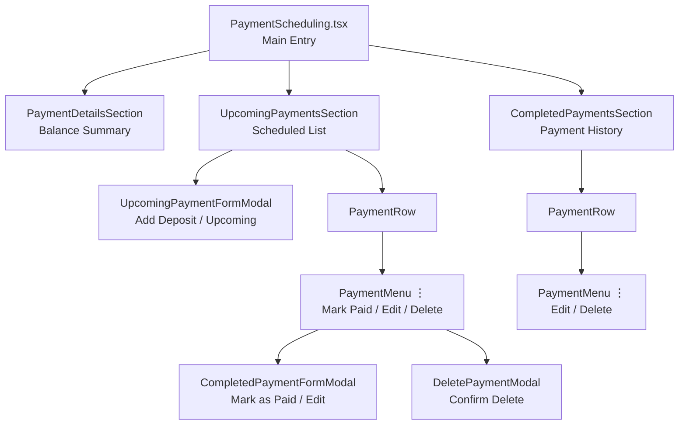
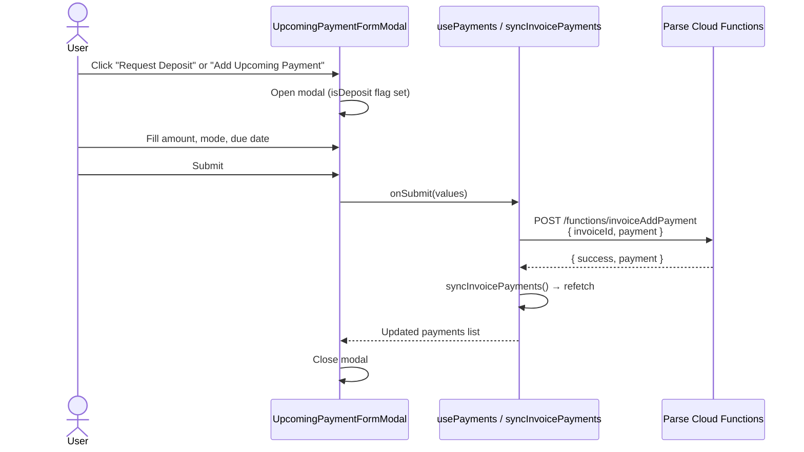
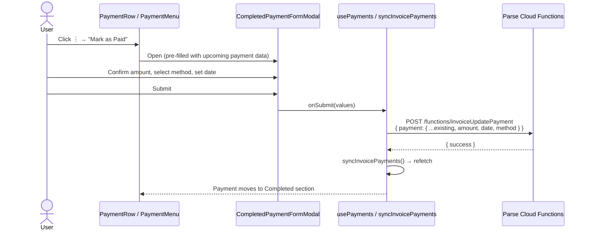
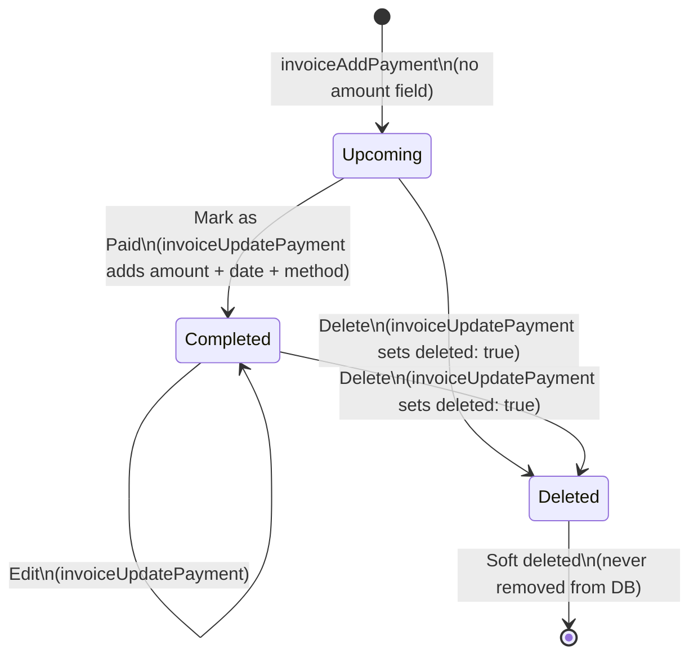
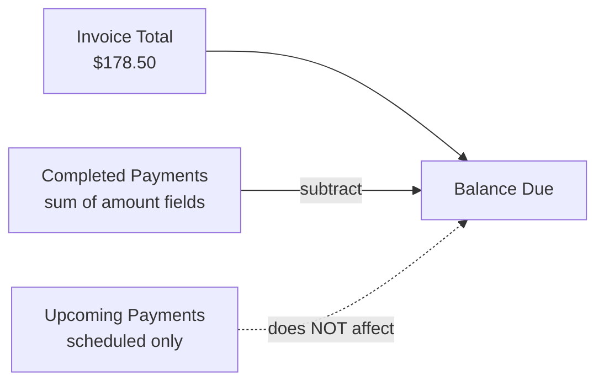
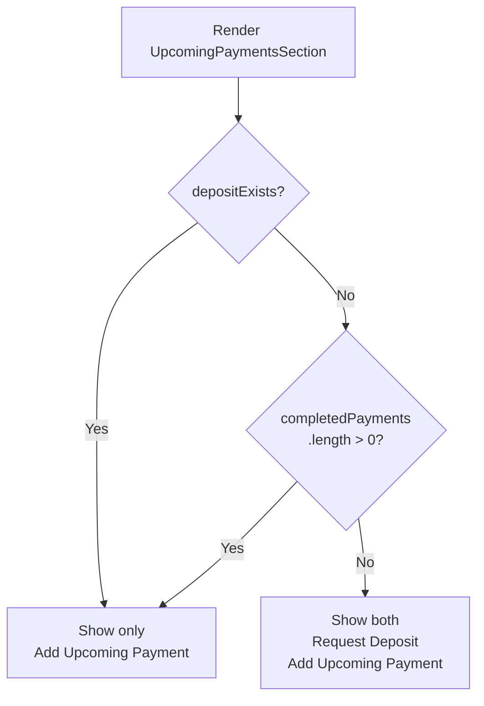
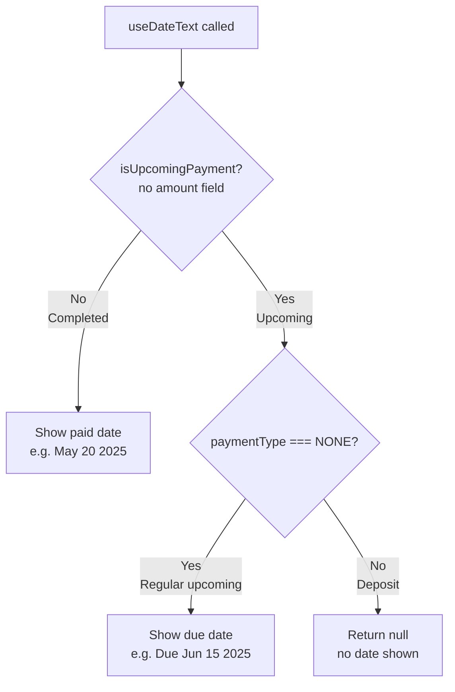

# Payment Scheduling — Mermaid Diagrams

## Component Architecture

---

## Data Flow: Add a Payment

---

## Data Flow: Mark as Paid

---

## Payment Lifecycle State Machine

---

## Balance Calculation

---

## "Request Deposit" Button Visibility

---

## Due Date Display Logic

